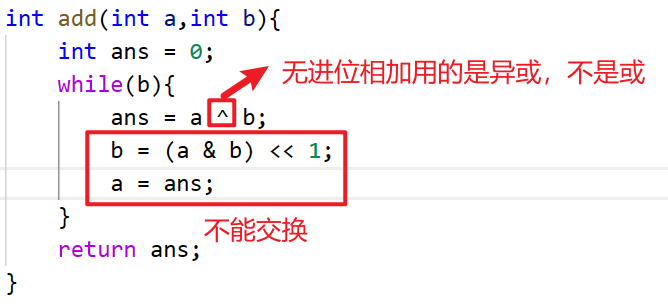

# 位运算实现加减乘除

**加法实现最重要，减乘除全部基于加法的实现**

测试链接：https://leetcode.cn/problems/divide-two-integers/
```c++
class Solution {
public:
    int divide(int a, int b) {
        if(a == INT_MIN && b == INT_MIN)
            return 1;
        else if(a != INT_MIN && b != INT_MIN)
            return div(a,b);
        else if(b == INT_MIN)
            return 0;
        else if(b == neg(1))
            return INT_MAX;
        
        if(b > 0)
            return div(a+b,b) - 1;
        else 
            return div(a-b,b) + 1;
    }

    int div(int a,int b){
        int x = a < 0 ? neg(a) : a;
        int y = b < 0 ? neg(b) : b;
        int ans = 0;
        for(int i = 30; i >= 0; i = minus(i,1)){
            if(x >> i >= y){ 
                ans |= 1 << i;
                x = minus(x,y << i);
            }
        }
        return a < 0 ^ b < 0 ? neg(ans) : ans;
    }
    int add(int a,int b){
        int ans = 0;
        while(b){
            ans = a ^ b;
            b = (a & b) << 1;
            a = ans;
        }
        return ans;
    }

    int minus(int a,int b){
        return add(a,neg(b));
    }

    int neg(int a){
        return add(~a,1);
    }

    int multiply(int a,int b){
        int ans = 0;
        while(b){
            if(b & 1)
                add(ans,b & 1);
            a <<= 1;
            b >>= 1;    
        }
        return ans;
    }
};
```
coding错误：
