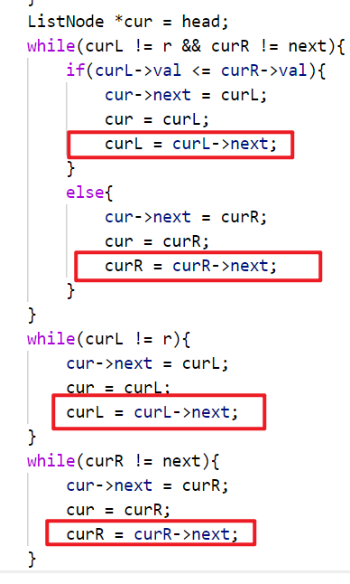

# 链表高频题目和必备技巧

## 链表类题目注意点
1. 如果笔试中空间要求不严格，直接使用容器来解决链表问题
2. 如果笔试中空间要求严格、或者在面试中面试官强调空间的优化，需要使用额外空间复杂度O(1)的方法
3. 最常用的技巧-快慢指针
4. 链表类题目往往都是很简单的算法问题，核心考察点并不是算法设计，是coding能力
5. 这一类问题除了多写多练没有别的应对方法

**链表问题既然练的就是coding，那么不要采取空间上讨巧的方式来练习

## 例题
1. 返回两个无环链表相交的第一个节点
测试链接：https://leetcode.cn/problems/intersection-of-two-linked-lists/
```c++
/**
 * Definition for singly-linked list.
 * struct ListNode {
 *     int val;
 *     ListNode *next;
 *     ListNode(int x) : val(x), next(NULL) {}
 * };
 */
class Solution {
public:
    ListNode *getIntersectionNode(ListNode *headA, ListNode *headB) {
        ListNode *curA = headA;
        ListNode *curB = headB;
        int cnt = 0;
        while(curA->next){
            cnt++;
            curA = curA->next;
        }
        while(curB->next){
            cnt--;
            curB = curB->next;
        }
        //最后的节点不一样，肯定没相交
        if(curA != curB)
            return nullptr;
        //最后的节点一样，Y，相交
        curA = headA;
        curB = headB;
        if(cnt > 0){    //A链表更长一点
            for(int i = 0; i < cnt; i++)
                curA = curA->next;
        }
        else{   //B链表更长一点
            for(int i = 0; i > cnt; i--)
                curB = curB->next;
        }
        //curA和curB经过上面的分支后到相交的节点距离相同，齐步走就会同时到达相交节点
        while(curA != curB)
            curA = curA->next,curB = curB->next;
        return curA;
    }
};
```

2. 每k个节点一组翻转链表
测试链接：https://leetcode.cn/problems/reverse-nodes-in-k-group/
```c++
/**
 * Definition for singly-linked list.
 * struct ListNode {
 *     int val;
 *     ListNode *next;
 *     ListNode() : val(0), next(nullptr) {}
 *     ListNode(int x) : val(x), next(nullptr) {}
 *     ListNode(int x, ListNode *next) : val(x), next(next) {}
 * };
 */
class Solution {
public:
    ListNode* reverseKGroup(ListNode* head, int k) {
        if(head == nullptr || head->next == nullptr || k < 2)
            return head;
        
        ListNode* l = head;
        ListNode* r = getKthNode(l,k);
        if(r == nullptr)
            return head;
        else
            head = reverse(l,r);

        ListNode* lastEnd = l;  //上一组反转之后的尾巴
        l = l->next;
        while(l){
            r = getKthNode(l,k);
            if(r)
                lastEnd->next = reverse(l,r);   //上一组的尾巴连上这一组的头
            else{
                lastEnd->next = l;
                break;
            }
            lastEnd = l;
            l = l->next;
        }

        return head;
    }

    ListNode* getKthNode(ListNode*cur,int k){
        while(--k && cur)
            cur = cur->next;
        return cur;
    }

    //将l->...->r反转，返回的是反转之后的头（r）
    ListNode* reverse(ListNode* l,ListNode* r){
        ListNode* pre = nullptr;
        ListNode* cur = l;
        ListNode* next = nullptr;

        while(cur != r){
            next = cur->next;
            cur->next = pre;
            pre = cur;
            cur = next;
        }
        //循环出来的时候，cur == r，少了一次反转
        l->next = cur->next;
        cur->next = pre;
        return r;
    }
};
```

3. 复制带随机指针的链表
测试链接：https://leetcode.cn/problems/copy-list-with-random-pointer/
```c++
/*
// Definition for a Node.
class Node {
public:
    int val;
    Node* next;
    Node* random;
    
    Node(int _val) {
        val = _val;
        next = NULL;
        random = NULL;
    }
};
*/

class Solution {
public:
    Node* copyRandomList(Node* head) {
        if(head == NULL)
            return NULL;
        Node* cur = head;
        Node* next = NULL;
        while(cur){
            next = cur->next;
            cur->next = new Node(cur->val);
            cur->next->next = next;
            cur = next;
        }

        //经过上面的循环，链表变成1->1'->2->2'->...->n->n'
        cur = head;
        while(cur){
            cur->next->random = cur->random ? cur->random->next : NULL;
            cur = cur->next->next;
        }

        //分开两个链表
        cur = head;
        head = head->next;
        while(cur){
            next = cur->next->next;
            cur->next->next = next ? next->next : NULL;
            cur->next = next;
            cur = next;
        }
        return head;
    }
};
```

4. 判断链表是否是回文结构。
这个题的流程设计甚至是考研常用。快慢指针找中点
测试链接：https://leetcode.cn/problems/palindrome-linked-list/
```c++
/**
 * Definition for singly-linked list.
 * struct ListNode {
 *     int val;
 *     ListNode *next;
 *     ListNode() : val(0), next(nullptr) {}
 *     ListNode(int x) : val(x), next(nullptr) {}
 *     ListNode(int x, ListNode *next) : val(x), next(next) {}
 * };
 */
class Solution {
public:
    bool isPalindrome(ListNode* head) {
        if(head == nullptr || head->next == nullptr)
            return true;
        
        ListNode* slow_point = head;
        ListNode* fast_point = head;
        while(fast_point->next && fast_point->next->next){
            slow_point = slow_point->next;
            fast_point = fast_point->next->next;
        }

        //后半部分反转
        //偶数长度举例：1 -> 2 <- 2 <- 1
        //奇数长度举例：1 -> 2 -> 3 <- 2 <- 1
        ListNode* pre = slow_point;
        ListNode* cur = slow_point->next;
        ListNode* next = nullptr;
        while(cur){
            next = cur->next;
            cur->next = pre;
            pre = cur;
            cur = next;
        }

        //pre就是后半部分的头
        //cur，next指针复用
        //cur前半部分当前位置
        //next后半部分当前位置
        bool ans = true;
        cur = head;
        next = pre;
        while(next != slow_point){
            if(cur->val != next->val){
                ans = false;
                break;
            }
            cur = cur->next;
            next = next->next;
        }

        //还原链表
        cur = pre;
        pre = nullptr;
        while(cur != slow_point){
            next = cur->next;
            cur->next = pre;
            pre = cur;
            cur = next;
        }
        //slow_point->next = pre; 这句没有用，因为slow_point的next一直就没修改过

        return ans;
    }
};
```

5. 返回链表的第一个入环节点。快慢指针找中点
测试链接：https://leetcode.cn/problems/linked-list-cycle-ii/
```c++
class Solution {
public:
    ListNode *detectCycle(ListNode *head) {
        if(head == NULL || head->next == NULL || head->next->next == NULL)
            return NULL;
        //不能一开始同时指向头，这样会让下面的循环直接结束
        ListNode *fast_point = head->next->next;
        ListNode *slow_point = head->next;

        //到末尾了（无环）或者快慢指针相遇（有环）时会退出循环
        while(fast_point->next && fast_point->next->next && slow_point != fast_point){
            slow_point = slow_point->next;
            fast_point = fast_point->next->next;
        }
        //不是因为相遇而退出循环，一眼丁真，鉴定为无环
        if(slow_point != fast_point)
            return NULL;
        
        fast_point = head;
        while(fast_point != slow_point){
            fast_point = fast_point->next;
            slow_point = slow_point->next;
        }

        return fast_point;
    }
};
```

6. 在链表上排序。要求时间复杂度O(n * log n)，额外空间复杂度O(1)，还要求排序由稳定性。
测试链接：https://leetcode.cn/problems/sort-list/
```c++
class Solution {
public:
    ListNode* sortList(ListNode* head) {
        int len = length(head);
        if(len < 2)
            return head;

        for(int step = 1; step < len; step <<= 1){
            ListNode* l = head;
            ListNode* r = findKthNode(l,step);
            if(r == nullptr)
                break;
            //即是右组的结束判断依据，又是可能的下一组的左组起始位置（next不空的话）
            ListNode* next = findKthNode(r,step);
            //选出新头
            pair<ListNode*,ListNode*> headAndEnd= merge(l,r,next);
            head = headAndEnd.first;
            ListNode *lastEnd = headAndEnd.second;
            lastEnd->next = next;
            l = next;
            while(l){
                ListNode* r = findKthNode(l,step);
                //没有右组
                if(r == nullptr)
                    break;
                next = findKthNode(r,step);
                headAndEnd = merge(l,r,next);
                lastEnd->next = headAndEnd.first;
                lastEnd = headAndEnd.second;
                lastEnd->next = next;
                l = next;
            }
        }
        return head;
    }

    //返回新头
    pair<ListNode*,ListNode*> merge(ListNode* l,ListNode* r,ListNode* next){
        //选出新头
        ListNode *head = nullptr;
        ListNode *curL = l;
        ListNode *curR = r;
        if(l->val <= r->val){
            head = l;
            curL = l->next;
        }
        else{
            head = r;
            curR = r->next;
        }
        ListNode *cur = head;
        while(curL != r && curR != next){
            if(curL->val <= curR->val){
                cur->next = curL;
                cur = curL;
                curL = curL->next;
            }
            else{
                cur->next = curR;
                cur = curR;
                curR = curR->next;
            }
        }
        while(curL != r){
            cur->next = curL;
            cur = curL;
            curL = curL->next;
        }
        while(curR != next){
            cur->next = curR;
            cur = curR;
            curR = curR->next;
        }

        return {head,cur};
    }

    ListNode* findKthNode(ListNode* cur,int k){
        while(k-- && cur){
            cur = cur->next;
        }
        return cur;
    }

    //计算链表长度
    int length(ListNode* head){
        int ans = 0;
        while(head){
            ans++;
            head = head->next;
        }
        return ans;
    }
};
```
**错误原因：未更新指针**

简化版code
```c++
class Solution {
public:
    ListNode* sortList(ListNode* head) {
        if(head == nullptr || head->next == nullptr)
            return head;
        
        //step代表每组的长度（不管是左组还是右组）
        for(int step = 1; true; step <<= 1){
            ListNode* l = head;
            ListNode* r = findKthNode(l,step);
            if(r == nullptr)
                break;
            //即是右组的结束判断依据，又是可能的下一组的左组起始位置（next不空的话）
            ListNode* next = findKthNode(r,step);
            //选出新头
            pair<ListNode*,ListNode*> headAndEnd= merge(l,r,next);
            head = headAndEnd.first;                //跟新链表头部
            ListNode *lastEnd = headAndEnd.second;  //记录合并后的链表尾巴
            lastEnd->next = next;   //不能删掉，删掉会漏掉下一个两组合并的过程没有右组的情况
            l = next;   //去到下一个两组合并的过程
            while(l){
                ListNode* r = findKthNode(l,step);
                //没有右组
                if(r == nullptr)
                    break;
                next = findKthNode(r,step);
                headAndEnd = merge(l,r,next);
                lastEnd->next = headAndEnd.first;   //上一次合并链表的尾连到本次合并链表的头
                lastEnd = headAndEnd.second;        //更新成本次合并链表的尾 
                lastEnd->next = next;
                l = next;
            }
        }

        return head;
    }

    //返回合并后链表的头和尾
    pair<ListNode*,ListNode*> merge(ListNode* l,ListNode* r,ListNode* next){
        //选出新头
        ListNode *head = nullptr;
        ListNode *curL = l;
        ListNode *curR = r;
        if(l->val <= r->val){
            head = l;
            curL = l->next;
        }
        else{
            head = r;
            curR = r->next;
        }
        ListNode *cur = head;
        while(curL != r && curR != next){
            if(curL->val <= curR->val){
                cur->next = curL;
                cur = curL;
                curL = curL->next;
            }
            else{
                cur->next = curR;
                cur = curR;
                curR = curR->next;
            }
        }
        while(curL != r){
            cur->next = curL;
            cur = curL;
            curL = curL->next;
        }
        while(curR != next){
            cur->next = curR;
            cur = curR;
            curR = curR->next;
        }

        return {head,cur};
    }

    //根据step找到下一组的头
    ListNode* findKthNode(ListNode* cur,int k){
        while(k-- && cur){
            cur = cur->next;
        }
        return cur;
    }
};
```