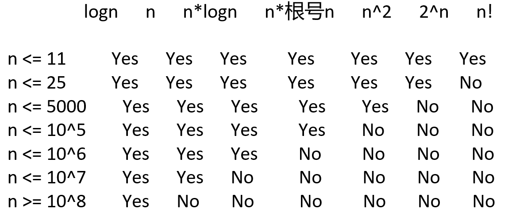

# 根据数据量猜解法的技巧-天字第一号重要技巧

这个技巧太重要了！既可以提前获知自己的方法能不能通过，也可以对题目的分析有引导作用

## 一个基本事实
C/C++运行时间1s，java/python/go等其他语言运行时间1s~2s，
对应的常数操作量是 10^7 ~ 10^8，不管什么测试平台，不管什么CPU，都是这个数量级
所以根据这个基本事实，来猜测自己设计的算法最终有没有可能在规定时间内通过

## 运用该技巧的必要条件
1. 题目要给定各个入参的范围最大值，正式笔试、比赛的题目一定都会给，面试中要和面试官确认
2. 对于自己设计的算法，时间复杂度要有准确的估计

## 问题规模和可用算法


这张表其实作用有限
因为时间复杂度的估计很多时候并不是一个入参决定，可能是多个入参共同决定。比如O(n*m), O(n+m)等
所以最关键就是记住常数指令操作量是10^7 ~ 10^8，然后方法是什么复杂度就可以估计能否通过了

## 例题

### 题目1：最优的技能释放顺序

该题的n非常小，用全排列就足以解决，考场上急的话根本不用想更好的解法

测试链接：https://www.nowcoder.com/practice/d88ef50f8dab4850be8cd4b95514bbbd

```c++
#include <climits>
#include<cstdio>
#include<vector>
using namespace std;

void swap(vector<int>& damage, vector<int>& blood, int i, int j) {
    int tmp = damage[i];
    damage[i] = damage[j];
    damage[j] = tmp;
    tmp = blood[i];
    blood[i] = blood[j];
    blood[j] = tmp;
}

//通过全排列枚举出所有的技能组合，挑出最优的技能释放顺序
int f(vector<int>& damage, vector<int>& blood, int restBlood, int i) {
    if (restBlood <= 0)
        return i;   //用了i个技能就把怪兽干死了
    if (i == damage.size())
        return INT_MAX;

    int ans = INT_MAX;
    for (int j = i; j < damage.size(); j++) {
        swap(damage, blood, i, j);
        ans = min(ans, f(damage, blood,
                         restBlood - (restBlood <= blood[i] ? 2 * damage[i] :
                                      damage[i]), i + 1));
        swap(damage, blood, i, j);
    }

    return ans;
}

int minSkills(vector<int>& damage, vector<int>& blood, int restBlood) {
    int ans = f(damage, blood, restBlood, 0);
    return ans == INT_MAX ? -1 : ans;
}

int main() {
    int T;
    int n, m;
    scanf("%d", &T);

    while (T--) {
        scanf("%d%d", &n, &m);
        vector<int> damage(n);
        vector<int> blood(n);
        for (int i = 0; i < n; i++)
            scanf("%d%d", &damage[i], &blood[i]);
        printf("%d\n", minSkills(damage, blood, m));
    }

    return 0;
}
// 64 位输出请用 printf("%lld")
```

### 题目2：超级回文数的数目
如果一个正整数自身是回文数，而且它也是一个回文数的平方，那么我们称这个数为超级回文数。
现在，给定两个正整数 L 和 R （以字符串形式表示），
返回包含在范围 [L, R] 中的超级回文数的数目。
1 <= len(L) <= 18
1 <= len(R) <= 18
L 和 R 是表示 [1, 10^18) 范围的整数的字符串
测试链接：https://leetcode.cn/problems/super-palindromes/
#### 解法一：10^18 -> 10^9 -> 10^5，考虑本身就是回文数（靠自己用seed扩展出来）的平方是不是回文数，
```c++
#include<cmath>
class Solution {
public:
    //根据seed生成偶数长度的回文串
    unsigned long long generateEvenLength(unsigned long long seed){
        unsigned long long ans = seed;
        while(seed){
            ans = ans * 10 + seed % 10;
            seed /= 10;
        }
        return ans;
    }

    //根据seed生成奇数长度的回文串
    unsigned long long generateOddLength(unsigned long long seed){
        unsigned long long ans = seed;
        seed /= 10;     //最后一个数字出现一次，两次就变成偶数长度了
        while(seed){
            ans = ans * 10 + seed % 10;
            seed /= 10;
        }
        return ans;
    }

    bool isPalindromeNum(unsigned long long num){
        unsigned long long offset = 1;
        //生成与num长度相同的最小数字，即100...0
        while(num / offset >= 10)
            offset *= 10;
        
        while(num){
            //最高位和最低位不同
            if(num / offset != num % 10)
                return false;
            //最高位比过了，除去
            num %= offset;
            num /= 10;
            offset /= 100;
        }

        return true;
    }

    bool check(unsigned long long num, unsigned long long L, unsigned long long R){
        if(num >= L && num <=R && isPalindromeNum(num))
            return true;
        else
            return false;
    }

    int superpalindromesInRange(string left, string right) {
        unsigned long long L = stoull(left);
        unsigned long long R = stoull(right);

        unsigned long long limit = sqrt(R);
        unsigned long long seed = 1;

        int ans = 0;
        unsigned long long num = 0;
        do{
            num = generateEvenLength(seed);
            if(check(num * num, L, R))
                ans++;    
            num = generateOddLength(seed);
            if(check(num * num, L, R))
                ans++;
            seed++;
        }while(num < limit);    //奇数长度的串都比限制大了，就没必要搞更大的数字了

        return ans;
    }
};
```

#### 解法二：打表法（快的起飞）
```c++
#include<cmath>
#include<cstdio>
#include<algorithm>
#include<vector>

const vector<unsigned long long> allSuperpalindromes = {
        1ULL,
        4ULL,
        9ULL,
        121ULL,
        484ULL,
        10201ULL,
        12321ULL,
        14641ULL,
        40804ULL,
        44944ULL,
        1002001ULL,
        1234321ULL,
        4008004ULL,
        100020001ULL,
        102030201ULL,
        104060401ULL,
        121242121ULL,
        123454321ULL,
        125686521ULL,
        400080004ULL,
        404090404ULL,
        10000200001ULL,
        10221412201ULL,
        12102420121ULL,
        12345654321ULL,
        40000800004ULL,
        1000002000001ULL,
        1002003002001ULL,
        1004006004001ULL,
        1020304030201ULL,
        1022325232201ULL,
        1024348434201ULL,
        1210024200121ULL,
        1212225222121ULL,
        1214428244121ULL,
        1232346432321ULL,
        1234567654321ULL,
        4000008000004ULL,
        4004009004004ULL,
        100000020000001ULL,
        100220141022001ULL,
        102012040210201ULL,
        102234363432201ULL,
        121000242000121ULL,
        121242363242121ULL,
        123212464212321ULL,
        123456787654321ULL,
        400000080000004ULL,
        10000000200000001ULL,
        10002000300020001ULL,
        10004000600040001ULL,
        10020210401202001ULL,
        10022212521222001ULL,
        10024214841242001ULL,
        10201020402010201ULL,
        10203040504030201ULL,
        10205060806050201ULL,
        10221432623412201ULL,
        10223454745432201ULL,
        12100002420000121ULL,
        12102202520220121ULL,
        12104402820440121ULL,
        12122232623222121ULL,
        12124434743442121ULL,
        12321024642012321ULL,
        12323244744232321ULL,
        12343456865434321ULL,
        12345678987654321ULL,
        40000000800000004ULL,
        40004000900040004ULL
    };
class Solution {
public:
    int superpalindromesInRange(string left, string right) {
        unsigned long long L = stoull(left);
        unsigned long long R = stoull(right);
        //allsuperpalindromesInLargestRange();

        int n = allSuperpalindromes.size();
        //还可以用二分来优化，但是没必要了，已经无敌了
        //找出在[L, R]范围内的第一个超级回文数
        int start = 0;
        while(start < n && allSuperpalindromes[start] < L)
            start++;
        //找出在[L, R]范围内的最后一个超级回文数
        int end = n - 1;
        while(end >= 0 && allSuperpalindromes[end] > R) 
            end--;

        return end - start + 1;
    }

    //根据seed生成偶数长度的回文串
    unsigned long long generateEvenLength(unsigned long long seed){
        unsigned long long ans = seed;
        while(seed){
            ans = ans * 10 + seed % 10;
            seed /= 10;
        }
        return ans;
    }

    //根据seed生成奇数长度的回文串
    unsigned long long generateOddLength(unsigned long long seed){
        unsigned long long ans = seed;
        seed /= 10;     //最后一个数字出现一次，两次就变成偶数长度了
        while(seed){
            ans = ans * 10 + seed % 10;
            seed /= 10;
        }
        return ans;
    }

    bool isPalindromeNum(unsigned long long num){
        unsigned long long offset = 1;
        //生成与num长度相同的最小数字，即100...0
        while(num / offset >= 10)
            offset *= 10;
        
        while(num){
            //最高位和最低位不同
            if(num / offset != num % 10)
                return false;
            //最高位比过了，除去
            num %= offset;
            num /= 10;
            offset /= 100;
        }

        return true;
    }

    bool check(unsigned long long num, unsigned long long L, unsigned long long R){
        if(num >= L && num <=R && isPalindromeNum(num))
            return true;
        else
            return false;
    }

    void allsuperpalindromesInLargestRange(){
        unsigned long long L = 1;
        unsigned long long R = 1e18;
        
        unsigned long long limit = sqrt(R);
        unsigned long long seed = 1;

        unsigned long long num;
        vector<unsigned long long> ans;

        do{
            num = generateEvenLength(seed);
            if(check(num * num,L,R))
                ans.push_back(num * num);

            num = generateOddLength(seed);
            if(check(num * num,L,R))
                ans.push_back(num * num);
            seed++;
        }while(num < limit);

        sort(ans.begin(), ans.end());
        for(unsigned long long num : ans)
            printf("%lluULL,\n", num);
    }
};
```