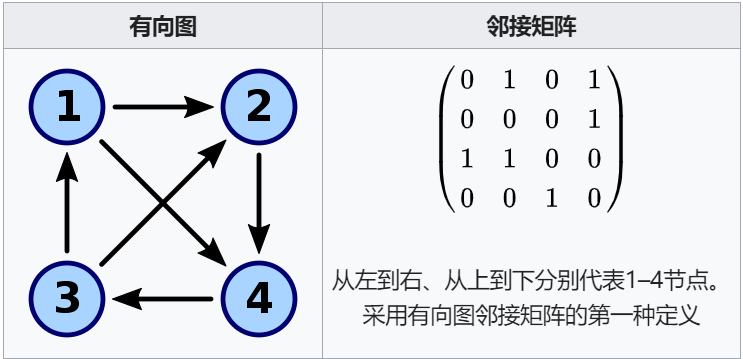
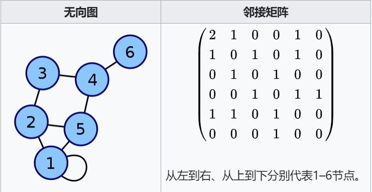
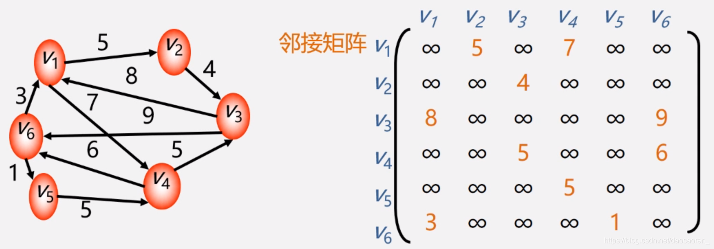
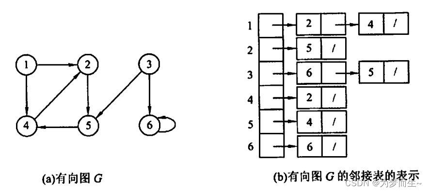
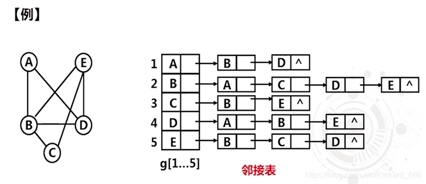
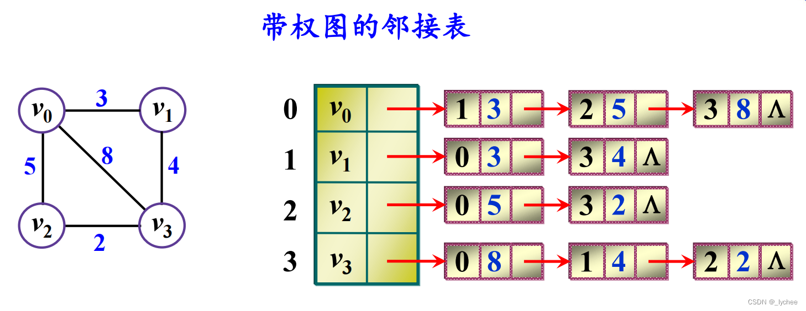
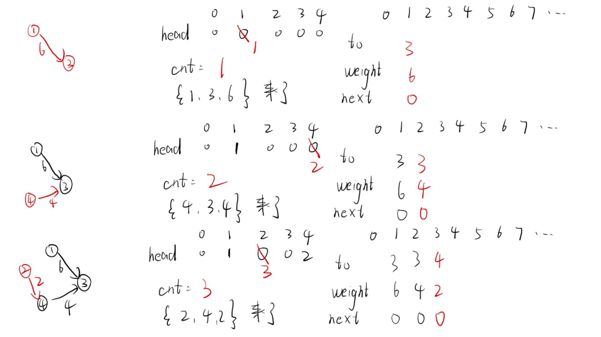
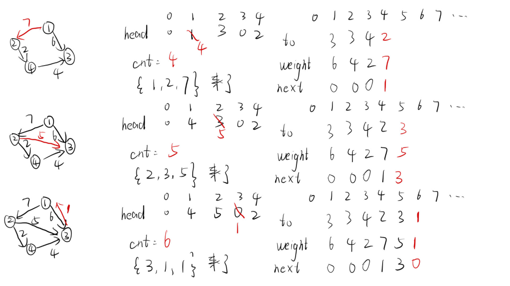

- [三种建图方式](#三种建图方式)
  - [邻接矩阵](#邻接矩阵)
    - [图解](#图解)
    - [代码](#代码)
  - [邻接表](#邻接表)
    - [图解](#图解-1)
    - [代码](#代码-1)
  - [链式前向星](#链式前向星)
    - [图解](#图解-2)
    - [代码](#代码-2)
- [拓扑排序](#拓扑排序)
  - [求解流程](#求解流程)
  - [模板代码](#模板代码)
  - [相关题目](#相关题目)
    - [题目1：课程表](#题目1课程表)
    - [题目2：课程表Ⅱ](#题目2课程表ⅱ)
    - [题目3：字典序最小的拓扑排序](#题目3字典序最小的拓扑排序)
    - [题目4：火星词典](#题目4火星词典)
    - [题目5：戳印序列](#题目5戳印序列)
  - [拓展技巧](#拓展技巧)
    - [题目1：最大食物链计数](#题目1最大食物链计数)
    - [题目2：喧闹和富有](#题目2喧闹和富有)
    - [题目3：并行课程Ⅲ](#题目3并行课程ⅲ)
    - [题目4：参加会议的最多员工数](#题目4参加会议的最多员工数)
- [最小生成树](#最小生成树)
  - [Kruskal算法（最常用）](#kruskal算法最常用)
    - [求解流程](#求解流程-1)
    - [模板代码](#模板代码-1)
  - [Prim算法（不算常用）](#prim算法不算常用)
    - [普通版](#普通版)
      - [求解流程](#求解流程-2)
      - [模板代码](#模板代码-2)
    - [优化版](#优化版)
      - [求解流程](#求解流程-3)
      - [模板代码](#模板代码-3)
  - [相关题目](#相关题目-1)
    - [题目1：水资源分配优化](#题目1水资源分配优化)
    - [题目2：检查边长度限制的路径是否存在](#题目2检查边长度限制的路径是否存在)
    - [题目3：繁忙的都市](#题目3繁忙的都市)
- [宽度优先遍历及其拓展](#宽度优先遍历及其拓展)
  - [宽度优先遍历基本内容](#宽度优先遍历基本内容)
    - [内容介绍](#内容介绍)
    - [相关题目](#相关题目-2)
      - [题目1：地图分析](#题目1地图分析)
      - [题目2：贴纸拼词](#题目2贴纸拼词)
  - [01bfs](#01bfs)
    - [求解流程](#求解流程-4)
    - [相关题目](#相关题目-3)
      - [题目1：到达角落需要移除障碍物的最小数目](#题目1到达角落需要移除障碍物的最小数目)
      - [题目2：使网格图至少有一条有效路径的最小代价](#题目2使网格图至少有一条有效路径的最小代价)
  - [宽度优先遍历与优先级队列结合](#宽度优先遍历与优先级队列结合)
    - [相关题目：二维接雨水](#相关题目二维接雨水)
  - [bfs与dfs结合](#bfs与dfs结合)
    - [相关题目：单次接龙Ⅱ](#相关题目单次接龙ⅱ)
- [双向广搜](#双向广搜)
  - [常见用途](#常见用途)
    - [小优化](#小优化)
    - [**重要！本体！用于解决特征很明显的一类问题**](#重要本体用于解决特征很明显的一类问题)
  - [相关题目](#相关题目-4)
    - [题目1：单词接龙](#题目1单词接龙)
    - [题目2：世界冰球锦标赛](#题目2世界冰球锦标赛)
    - [题目3：最接近目标值的子序列和](#题目3最接近目标值的子序列和)
- [Dijkstra算法、分层图最短路](#dijkstra算法分层图最短路)
  - [Dijkstra算法](#dijkstra算法)
    - [简介](#简介)
    - [普通堆实现](#普通堆实现)
      - [求解流程](#求解流程-5)
      - [代码实现](#代码实现)
    - [反向索引堆实现](#反向索引堆实现)
      - [求解流程](#求解流程-6)
      - [代码实现](#代码实现-1)
    - [相关题目](#相关题目-5)
      - [题目1：最小体力消耗路径](#题目1最小体力消耗路径)
      - [题目2：水位上升的泳池中游泳](#题目2水位上升的泳池中游泳)
  - [分层图最短路](#分层图最短路)
    - [相关题目](#相关题目-6)
      - [题目1：获取所有钥匙的最短路径](#题目1获取所有钥匙的最短路径)
      - [题目2：电动车游城市](#题目2电动车游城市)
      - [题目3：飞行路线](#题目3飞行路线)
- [A星、Floyd、Bellman-Ford与SPFA](#a星floydbellman-ford与spfa)
  - [A星](#a星)
    - [算法简介](#算法简介)
    - [算法模板](#算法模板)
  - [Floyd](#floyd)
    - [算法简介](#算法简介-1)
    - [代码模板](#代码模板)
  - [Bellman-Ford与SPFA](#bellman-ford与spfa)
    - [Bellman-Ford过程](#bellman-ford过程)
    - [Bellman-Ford算法时间复杂度](#bellman-ford算法时间复杂度)
    - [重要推广：判断从某个点出发能不能到达负环](#重要推广判断从某个点出发能不能到达负环)
    - [相关题目：K 站中转内最便宜的航班](#相关题目k-站中转内最便宜的航班)
    - [Bellman-Ford + SPFA优化（Shortest Path Faster Algorithm）](#bellman-ford--spfa优化shortest-path-faster-algorithm)
      - [简介](#简介-1)
      - [用途](#用途)
      - [模板题](#模板题)


## 三种建图方式

有向 vs 无向、不带权 vs 带权。入参一般为**节点数量n和所有的边**或者**直接给图**
代码均以**带权图**为例

### 邻接矩阵
适合点的数量不多的图

#### 图解




#### 代码
```c++
#include<cstdio>
#include<vector>
using std::vector;
const int MAXN = 11;    //点的最大数量
int graph[MAXN][MAXN];

void build(int n) {
    for (int i = 1; i <= n; i++) 
        for (int j = 1; j <= n; j++) 
            graph[i][j] = 0;
}

void directGraph(vector<vector<int>>& edges) {
    for (vector<int>& edge : edges)
        graph[edge[0]][edge[1]] = edge[2];
}

void undirectGraph(vector<vector<int>>& edges) {
    for (vector<int>& edge : edges) {
        graph[edge[0]][edge[1]] = edge[2];
        graph[edge[1]][edge[0]] = edge[2];
    }
}

void traversal(int n) {
    for (int i = 1; i <= n; i++) {
        for (int j = 1; j <= n; j++)
            printf("%d ", graph[i][j]);
        printf("\n");
    }
}

int main() {
    // 理解了带权图的建立过程，也就理解了不带权图
    // 点的编号为1...n
    // 有向带权图，然后打印结果
    int n1 = 4;
    vector<vector<int>> edges1 = {
        { 1, 3, 6 },
        { 4, 3, 4 },
        { 2, 4, 2 },
        { 1, 2, 7 },
        { 2, 3, 5 },
        { 3, 1, 1 }
    };
    build(n1);
    directGraph(edges1);
    traversal(n1);
    printf("==============================\n");
    //无向带权图，打印结果
    int n2 = 5;
    vector<vector<int>> edges2 = {
        { 3, 5, 4 }, 
        { 4, 1, 1 }, 
        { 3, 4, 2 }, 
        { 5, 2, 4 }, 
        { 2, 3, 7 }, 
        { 1, 5, 5 }, 
        { 4, 2, 6 }
    };
    build(n2);
    undirectGraph(edges2);
    traversal(n2);
    return 0;
}
```

### 邻接表
最常用的方式

#### 图解




#### 代码
```c++
#include<cstdio>
#include<vector>
#include<functional>
using std::vector;
using std::pair;

const int MAXN = 11;    //点的最大数量
vector<vector<pair<int, int>>> graph(MAXN, vector<pair<int, int>>());

void build(int n) {
    for (int i = 1; i <= n; i++)
        graph[i].clear();
}

void directGraph(vector<vector<int>>& edges) {
    for (vector<int>& edge : edges)
        graph[edge[0]].push_back({ edge[1], edge[2] });
}

void undirectGraph(vector<vector<int>>& edges) {
    for (vector<int>& edge : edges) {
        graph[edge[0]].push_back({ edge[1], edge[2] });
        graph[edge[1]].push_back({ edge[0],edge[2] });
    }
}

void traversal(int n) {
    for (int i = 1; i <= n; i++) {
        printf("%d + (邻居、边权)：", i);
        for (pair<int, int>& edge : graph[i])
            printf("(%d,%d) ", edge.first, edge.second);
        printf("\n");
    }
}

int main() {
    // 理解了带权图的建立过程，也就理解了不带权图
    // 点的编号为1...n
    // 有向带权图，然后打印结果
    int n1 = 4;
    vector<vector<int>> edges1 = {
        { 1, 3, 6 },
        { 4, 3, 4 },
        { 2, 4, 2 },
        { 1, 2, 7 },
        { 2, 3, 5 },
        { 3, 1, 1 }
    };
    build(n1);
    directGraph(edges1);
    traversal(n1);
    printf("==============================\n");
    //无向带权图，打印结果
    int n2 = 5;
    vector<vector<int>> edges2 = {
        { 3, 5, 4 }, 
        { 4, 1, 1 }, 
        { 3, 4, 2 }, 
        { 5, 2, 4 }, 
        { 2, 3, 7 }, 
        { 1, 5, 5 }, 
        { 4, 2, 6 }
    };
    build(n2);
    undirectGraph(edges2);
    traversal(n2);
    return 0;
}
```

### 链式前向星
空间要求严苛情况下使用。比赛必用，大厂笔试、面试不常用

#### 图解



#### 代码
```c++
#include<cstdio>
#include<vector>
using std::vector;

const int MAXN = 11;    //点的最大数量
const int MAXM = 21;    //边的最大数量
int head[MAXN];
int to[MAXM];
int weight[MAXM];
int next[MAXM];
int cnt;

void build(int n) {
    cnt = 1;
    //0在这里相当于邻接表的空指针（如果是链表实现的话）
    for (int i = 1; i <= n; i++)
        head[i] = 0;
}

void addEdge(int from, int t, int w) {
    //相当于设置节点的data域
    to[cnt] = t;
    weight[cnt] = w;
    //相当于头插法插入链表
    next[cnt] = head[from];
    head[from] = cnt++;
}

void directGraph(vector<vector<int>>& edges) {
    for (vector<int>& edge : edges)
        addEdge(edge[0], edge[1], edge[2]);
}

void undirectGraph(vector<vector<int>>& edges) {
    for (vector<int>& edge : edges) {
        addEdge(edge[0], edge[1], edge[2]);
        addEdge(edge[1], edge[0], edge[2]);
    }
}

void traversal(int n) {
    for (int i = 1; i <= n; i++) {
        printf("%d + (邻居、边权)：", i);
        for (int ei = head[i]; ei; ei = next[ei])
            printf("(%d, %d) ", to[ei], weight[ei]);
        printf("\n");
    }
}

int main() {
    // 理解了带权图的建立过程，也就理解了不带权图
    // 点的编号为1...n
    // 有向带权图，然后打印结果
    int n1 = 4;
    vector<vector<int>> edges1 = {
        { 1, 3, 6 },
        { 4, 3, 4 },
        { 2, 4, 2 },
        { 1, 2, 7 },
        { 2, 3, 5 },
        { 3, 1, 1 }
    };
    build(n1);
    directGraph(edges1);
    traversal(n1);
    printf("==============================\n");
    //无向带权图，打印结果
    int n2 = 5;
    vector<vector<int>> edges2 = {
        { 3, 5, 4 }, 
        { 4, 1, 1 }, 
        { 3, 4, 2 }, 
        { 5, 2, 4 }, 
        { 2, 3, 7 }, 
        { 1, 5, 5 }, 
        { 4, 2, 6 }
    };
    build(n2);
    undirectGraph(edges2);
    traversal(n2);
    return 0;
}
```

## 拓扑排序

每个节点的前置节点都在这个节点之前

### 求解流程

**要求**：有向无环图
拓扑排序的顺序可能不止一种。拓扑排序也可以用来判断有没有环。
1. 在图中找到所有入度为0的点
2. 把所有入度为0的点在图中删掉，重点就是**删掉影响**！继续找到入度为0的点并删掉影响
3. 直到所有点都被删掉，依次删除的顺序就是正确的拓扑排序结果
4. 如果无法把所有的点都删掉，说明有向图里有环

### 模板代码
测试链接：https://www.nowcoder.com/practice/88f7e156ca7d43a1a535f619cd3f495c
1. 动态实现(邻接表)
```c++
#include<cstdio>
#include<vector>
using std::vector;

const int MAXN = 200005;

int queue[MAXN];    //队列，用于实时装载入度为0的节点
int front,back;

vector<vector<int>> graph(MAXN, vector<int>());
int indegree[MAXN];

int ans[MAXN]; //装最后排序的答案（如果有拓扑排序的话

bool topologicalSort(int n){
    front = back = 0; //队列清空
    for(int i = 1; i <= n; i++){
        if(indegree[i] == 0)
            queue[back++] = i;
    }
    int size = 0;
    while(front < back){
        int cur = queue[front++];
        ans[size++] = cur;
        for(int to : graph[cur]){
            if(--indegree[to] == 0) //to节点在消除该节点的影响后，入度为0，入队
                queue[back++] = to;
        }
    }
    return size == n;
}

int main() {
    int n,m,u,v;
    scanf("%d%d", &n, &m);
    while(m--){
        scanf("%d%d", &u, &v);
        graph[u].push_back(v);
        indegree[v]++;
    }
    if(topologicalSort(n)){
        for(int i = 0; i < n - 1; i++)
            printf("%d ", ans[i]);
        printf("%d\n", ans[n - 1]);
    }
    else 
        printf("-1");

    return 0;
}
```

2. 静态实现(链式前向星)
```c++
#include<cstdio>

const int MAXN = 200005;
const int MAXM = 200005;
//拓扑排序需要，快速收集实时入度为0的节点
int indegree[MAXN];
int queue[MAXN];
int front, back;
//建图需要
int head[MAXN] = { 0 };
int to[MAXM];
int next[MAXM];
int cnt;
//收集答案需要
int ans[MAXN];


void addEdge(int u, int v) {
    to[cnt] = v;
    next[cnt] = head[u];
    head[u] = cnt++;
}

bool topologicalSort(int n) {
    front = back = 0;
    for (int i = 1; i <= n; i++) {
        if (indegree[i] == 0)
            queue[back++] = i;
    }
    int size = 0;
    while (front < back) {
        int u = queue[front++];
        ans[size++] = u;
        for (int edgeId = head[u]; edgeId; edgeId = next[edgeId]) {
            if (--indegree[to[edgeId]] == 0)
                queue[back++] = to[edgeId];
        }
    }
    return size == n;
}

int main() {
    cnt = 1;
    int n, m, u, v;
    scanf("%d%d", &n, &m);
    while (m--) {
        scanf("%d%d", &u, &v);
        addEdge(u, v);
        indegree[v]++;
    }
    if (topologicalSort(n)) {
        for (int i = 0; i < n - 1; i++)
            printf("%d ", ans[i]);
        printf("%d\n", ans[n - 1]);
    }
    else
        printf("-1\n");

    return 0;
}
```

### 相关题目

#### 题目1：课程表
测试链接：https://leetcode.cn/problems/course-schedule/
```c++
class Solution {
private:
    static const int MAXN = 2005;
    static int queue[MAXN];
    int front, back;

public:
    bool canFinish(int numCourses, vector<vector<int>>& prerequisites) {
        vector<vector<int>> graph(numCourses, vector<int>());
        vector<int> indegree(numCourses);
        // 看清楚当前边哪个是from，哪个是to就行了
        for (vector<int>& edge : prerequisites) {
            graph[edge[1]].push_back(edge[0]);
            indegree[edge[0]]++;
        }
        front = back = 0;
        for (int i = 0; i < numCourses; i++) {
            if (indegree[i] == 0)
                queue[back++] = i;
        }
        while (front < back) {
            int from = queue[front++];
            for (int to : graph[from]) {
                if (--indegree[to] == 0)
                    queue[back++] = to;
            }
        }
        return back == numCourses;
    }
};
int Solution::queue[MAXN];
```

#### 题目2：课程表Ⅱ
测试链接：https://leetcode.cn/problems/course-schedule-ii/description/
```c++
class Solution {
private:
    static const int MAXN = 2005;
    static int queue[MAXN];
    int front, back;

public:
    vector<int> findOrder(int numCourses, vector<vector<int>>& prerequisites) {
        vector<vector<int>> graph(numCourses, vector<int>());
        vector<int> indegree(numCourses);
        for (vector<int>& edge : prerequisites) {
            graph[edge[1]].push_back(edge[0]);
            indegree[edge[0]]++;
        }
        front = back = 0;
        for (int i = 0; i < numCourses; i++) {
            if (indegree[i] == 0)
                queue[back++] = i;
        }
        while (front < back) {
            int from = queue[front++];
            for (int to : graph[from]) {
                if (--indegree[to] == 0)
                    queue[back++] = to;
            }
        }
        return back == numCourses ? vector<int>(queue, queue + back)
                                  : vector<int>();
    }
};
int Solution::queue[MAXN];
```

#### 题目3：字典序最小的拓扑排序
测试链接：https://www.luogu.com.cn/problem/U107394
```c++
#define _CRT_SECURE_NO_WARNINGS
#include<cstdio>

const int MAXN = 100005;
const int MAXM = 100005;
//链式前向星建图
int head[MAXN];
int to[MAXM];
int next[MAXM];
int cnt;
int n, m;
//保证字典序最小拓扑排序需要的小根堆
int heap[MAXN];
int size;
int indegree[MAXN];
//收集答案
int ans[MAXN];

void swap(int i, int j) {
    int tmp = heap[i];
    heap[i] = heap[j];
    heap[j] = tmp;
}

//值为i的元素进入小根堆
void push(int node) {
    int i = size;
    heap[size++] = node;
    while (heap[(i - 1) / 2] > heap[i]) {
        swap((i - 1) / 2, i);
        i = (i - 1) / 2;
    }
}

//堆顶元素(堆中字典序最小的)出堆
int pop() {
    int top = heap[0];
    heap[0] = heap[--size]; //堆最后一个元素补上
    int i = 0;
    int l = 1, r;
    while (l < size) {
        r = l + 1;
        int best = r < size && heap[r] < heap[l] ? r : l;
        best = heap[i] < heap[best] ? i : best;
        //插入在i位置符合小根堆特征
        if (i == best)
            break;
        swap(i, best);
        i = best;
        l = 2 * i + 1;
    }
    return top;
}

//保证字典序最小的拓扑排序
void topologicalSortPlus() {
    for (int i = 1; i <= n; i++) {
        if (indegree[i] == 0)
            push(i);
    }
    int ansSize = 0;
    //堆非空
    while (size > 0) {
        int from = pop();
        ans[ansSize++] = from;
        for (int ei = head[from]; ei; ei = next[ei]) {
            if (--indegree[to[ei]] == 0)
                push(to[ei]);
        }
    }
}

void addEdge(int u, int v) {
    to[cnt] = v;
    next[cnt] = head[u];
    head[u] = cnt++;
}

void build() {
    cnt = 1;
    size = 0;
    for (int i = 1; i <= n; i++) {
        indegree[i] = 0;
        head[i] = 0;
    }
}

int main() {
    scanf("%d%d", &n, &m);
    build();
    int u, v;
    while (m--) {
        scanf("%d%d", &u, &v);
        addEdge(u, v);
        indegree[v]++;
    }
    topologicalSortPlus();
    for (int i = 0; i < n - 1; i++)
        printf("%d ", ans[i]);
    printf("%d\n", ans[n - 1]);
    return 0;
}
```

#### 题目4：火星词典
测试链接：https://leetcode.cn/problems/Jf1JuT/description/
```c++
class Solution {
public:
    string alienOrder(vector<string>& words) {
        //初始化入度表，未出现的字符入度用-1表示
        vector<int> indegree(26, -1);
        for(string &word : words){
            for(char ch : word){
                indegree[ch - 'a'] = 0;
            }
        }
        // 建图，整理好入度表
        vector<vector<int>> graph(26, vector<int>());
        for (int i = 0, len, j; i < words.size() - 1; i++) {
            string& s = words[i];
            string& t = words[i + 1];
            len = min(s.size(), t.size());
            for (j = 0; j < len; j++) {
                if (s[j] != t[j]){
                    graph[s[j] - 'a'].push_back(t[j] - 'a');
                    indegree[t[j] - 'a']++;
                    break;
                }
            }
            // t竟然是s的前缀，怎么可能排在s后面
            if(j < s.size() && j == t.size())
                return "";
        }
        //进行拓扑排序得出火星词典
        int partcipatedNum = 26;    //参与排序的字母个数
        vector<char> queue(26);
        int front = 0, back = 0;
        for (int i = 0; i < 26; i++) {
            if (indegree[i] == 0)
                queue[back++] = 'a' + i;
            else if(indegree[i] == -1)  //入度为-1表示该字母未参与拓扑排序
                partcipatedNum--;
        }
        while (front < back) {
            char from = queue[front++];
            for (int to : graph[from - 'a']) {
                if (--indegree[to] == 0)
                    queue[back++] = to + 'a';
            }
        }
        return back == partcipatedNum
                   ? string(queue.begin(), queue.begin() + back)
                   : "";
    }
};
```

#### 题目5：戳印序列
测试链接：https://leetcode.cn/problems/stamping-the-sequence/
```c++
class Solution {
public:
    vector<int> movesToStamp(string stamp, string target) {
        int m = stamp.size();   //印章的长度
        int n = target.size();  //目标序列的长度
        int len = n - m + 1;    //有效盖章位置为[0, len)
        vector<int> indegree(len, 0);
        vector<vector<int>> graph(n, vector<int>());
        //i表示印章盖在i位置
        for(int i = 0; i < len; i++){
            for(int j = 0; j < m; j++){
                if(stamp[j] != target[i + j]){
                    //印章盖在i位置的时候，印章j下标位置会出错
                    //入度加一（错误的位置数量）并记录导致出错的位置
                    indegree[i]++;
                    graph[i + j].push_back(i);  
                }
            }
        }
        //初始化队列并让印章盖下去无错的位置入队
        vector<int> queue(len);
        int front = 0, back = 0;
        for(int i = 0; i < len; i++){
            if(indegree[i] == 0)
                queue[back++] = i;
        }
        vector<bool> visited(n, false); //出错影响消除了的位置
        while(front < back){
            int cur = queue[front++];
            for(int i = 0; i < m; i++){
                //该位置的影响没被消除
                if(visited[cur + i] == false){
                    visited[cur + i] = true;
                    for(int pos : graph[cur + i]){
                        if(--indegree[pos] == 0)
                            queue[back++] = pos;
                    }
                }
            }
        }
        //还有一个位置出错，就返回空数组
        for(int i = 0; i < n; i++){
            if(visited[i] == false)
                return vector<int> ();
        }
        //逆序一下，因为之前是从后往前考虑的，最后盖的才是未出错的位置
        for(int i = 0, j = back - 1; i < j; i++, j--){
            int tmp = queue[i];
            queue[i] = queue[j];
            queue[j] = tmp;
        }
        return vector<int>(queue.begin(), queue.begin() + back);
    }
};
```

### 拓展技巧

重要技巧：**利用拓扑排序的过程，上游节点逐渐推送消息给下游节点的技巧**

#### 题目1：最大食物链计数
测试链接：https://www.luogu.com.cn/problem/P4017
```c++
#include<cstdio>
const int MOD = 80112002;
const int MAXN = 5005;
const int MAXM = 500005;

//链式前向星建图需要
int head[MAXN];
int to[MAXM];
int next[MAXM];
int cnt;

//拓扑排序需要
int queue[MAXN];
int front, back;
int indegree[MAXN];

//拓扑排序过程中，推送的消息
int pathNum[MAXN];

//图的节点数和边数
int n, m;
void build() {
    cnt = 1;
    for (int i = 1; i <= n; i++) {
        head[i] = 0;
        indegree[i] = 0;
        pathNum[i] = 0; //清空防止后续叠加出错
    }
}

void addEdge(int u, int v) {
    to[cnt] = v;
    next[cnt] = head[u];
    head[u] = cnt++;
}

int topologicalSortPlus() {
    front = back = 0;
    for (int i = 1; i <= n; i++) {
        if (indegree[i] == 0) { //食物链低端
            queue[back++] = i;
            pathNum[i] = 1;
        }
    }
    int pathSum = 0;
    while (front < back) {
        int u = queue[front++];
        if (head[u] == 0)//食物链顶端，收集答案
            pathSum = (pathSum + pathNum[u]) % MOD;
        else{
            //一条边一条边的看，边号为0代表该边不存在，退出循环
            for (int ei = head[u], v; ei > 0; ei = next[ei]) {
                v = to[ei];
                pathNum[v] = (pathNum[v] + pathNum[u]) % MOD; //推送路径数量信息
                if (--indegree[v] == 0)
                    queue[back++] = v;
            }
        }
    }
    return pathSum;
}

int main() {
    scanf("%d%d", &n, &m);
    //建图
    build();
    int u, v;
    while (m--) {
        scanf("%d%d", &u, &v);
        addEdge(u, v);
        indegree[v]++;
    }
    //蕴含推送信息技巧的拓扑排序
    printf("%d\n", topologicalSortPlus());
    return 0;
}
```

#### 题目2：喧闹和富有
测试链接：https://leetcode.cn/problems/loud-and-rich/
```c++
class Solution {
public:
    vector<int> loudAndRich(vector<vector<int>>& richer, vector<int>& quiet) {
        int n = quiet.size();
        vector<vector<int>> graph(n, vector<int>());
        vector<int> indegree(n, 0);
        for(vector<int> &edge : richer){
            graph[edge[0]].push_back(edge[1]);
            indegree[edge[1]]++;
        }
        vector<int> answer(n);
        vector<int> queue(n);
        int front = 0, back = 0;
        for(int i = 0; i < n; i++){
            answer[i] = i; //一开始都假设是自己安静值最小
            if(indegree[i] == 0)    //n个实验对象中没有更有钱的了，还有谁
                queue[back++] = i;
        }
        while(front < back){
            int a = queue[front++];
            for(int b : graph[a]){
                if(quiet[answer[a]] < quiet[answer[b]]) //把更有钱更安静的人推给b
                    answer[b] = answer[a];
                if(--indegree[b] == 0)
                    queue[back++] = b;
            }
        }
        return answer;
    }
};
```

#### 题目3：并行课程Ⅲ
测试链接：https://leetcode.cn/problems/parallel-courses-iii/
```c++
class Solution {
public:
    int minimumTime(int n, vector<vector<int>>& relations, vector<int>& time) {
        //建图并初始化入度表
        vector<vector<int>> graph(n + 1, vector<int>());
        vector<int> indegree(n + 1, 0);
        for(vector<int> &edge : relations){
            graph[edge[0]].push_back(edge[1]);
            indegree[edge[1]]++;
        }
        //无前置课程的课程入队
        vector<int> queue(n);
        int front = 0, back = 0;
        for(int i = 1; i <= n; i++){
            if(indegree[i] == 0)
                queue[back++] = i;
        }
        //minMonth[i]表示上完课程编号为i的课程所需最小月份数
        vector<int> minMonth(n + 1, 0);
        while(front < back){
            int preCourseId = queue[front++];
            minMonth[preCourseId] += time[preCourseId - 1];
            for(int nextCourseId : graph[preCourseId]){
                //前置课程信息完成时间的推送
                minMonth[nextCourseId] = max(minMonth[nextCourseId], minMonth[preCourseId]);
                if(--indegree[nextCourseId] == 0)   //前置课程都上完了
                    queue[back++] = nextCourseId;
            }
        }
        //最后一个课上完就上完了
        int ans = 0;
        for(int i = 1; i <= n; i++)
            ans = max(ans, minMonth[i]);
        return ans;
    }
};
```

#### 题目4：参加会议的最多员工数
测试链接：https://leetcode.cn/problems/maximum-employees-to-be-invited-to-a-meeting/
```c++
class Solution {
public:
    //favorite天然就是一个图，只是每个节点的出度都为1
    int maximumInvitations(vector<int>& favorite) {
        int n = favorite.size();
        //初始化入度表
        vector<int> indegree(n, 0);
        for(int to : favorite)
            indegree[to]++;
        //拓扑排序：利用边缘节点向内推送信息，收集环上节点深度，并将不在环上的节点清除
        vector<int> queue(n);
        int front = 0, back = 0;
        for(int i = 0; i < n; i++){
            if(indegree[i] == 0)
                queue[back++] = i;
        }
        //基本事实：n个节点n条边 -> 肯定有环
        //deep代表环上节点能触碰的最远节点的深度，环上节点深度为0
        vector<int> deep(n, 0);
        while(front < back){
            int from = queue[front++];
            int to = favorite[from];
            deep[to] = deep[from] + 1;
            if(--indegree[to] == 0)
                queue[back++] = to;
        }
        //答案可能性1：所有（小环 + 2个员工触碰最远节点深度）之和
        //答案可能性2：最大的大环（员工数 > 2）
        int smallRingSum = 0;
        int bigRingMax = 0;
        for(int i = 0; i < n; i++){
            //找到了一个入环节点
            if(indegree[i] > 0){
                int ringSize = 1;   //计算该环的大小
                for(int next = favorite[i]; next != i; next = favorite[next]){
                    indegree[next] = 0; //下次遇到该环的其他节点会直接跳过
                    ringSize++;
                }
                if(ringSize == 2)
                    smallRingSum += (deep[i] + deep[favorite[i]] + 2);
                else
                    bigRingMax = max(bigRingMax, ringSize);
            }
        }
        return max(smallRingSum, bigRingMax);
    }
};
```

## 最小生成树

最小生成树：在**无项带权图**中选择一些边，在**保证连通性**的情况下，**边的总权值最小**
最小生成树可能不止一颗，只要保证边的总权值最小，就都是正确的最小生成树
如果无向带权图有n个点，那么最小生成树一定有n-1条边

### Kruskal算法（最常用）

#### 求解流程
1. 把所有的边，根据权值从小到大排序，从权值小的边开始考虑
2. 如果连接当前的边不会形成环，就选择当前的边
3. 如果连接当前的边会形成环，就不要当前的边
4. 考察完所有边之后，最小生成树也就得到了

#### 模板代码
测试链接：https://www.luogu.com.cn/problem/P3366
```c++
#include<cstdio>
#include<algorithm>
using std::sort;
const int MAXN = 5005;
const int MAXM = 200005;

struct Edge {
    int from, to, weight;
};
Edge edges[MAXM];

//并查集
int father[MAXN];

void build(int n) {
    for (int i = 1; i <= n; i++)
        father[i] = i;
}

int find(int i) {
    if (i != father[i])
        father[i] = find(father[i]);
    return father[i];
}

//返回值代表x和y是否属于同一个集合（会不会形成环）
bool unionTwoDifferentSet(int x, int y) {
    int fx = find(x);
    int fy = find(y);
    if (fx != fy) { //不在同一个集合，说明不会形成环
        father[fx] = fy;
        return true;
    }
    else
        return false;       
}

int main() {
    int n, m;
    scanf("%d%d", &n, &m);
    build(n);
    for (int i = 0; i < m; i++)
        scanf("%d%d%d", &edges[i].from, &edges[i].to, &edges[i].weight);
    //根据边的权值从小到大排序
    sort(edges, edges + m, [](Edge& e1, Edge& e2) {return e1.weight < e2.weight; });
    int sumWeight = 0;
    int edgeNum = 0;
    for (int i = 0, from, to, weight; i < m; i++) {
        from = edges[i].from;
        to = edges[i].to;
        weight = edges[i].weight;
        if (unionTwoDifferentSet(from, to)) { 
            sumWeight += weight;
            edgeNum++;
        }
    }
    if (edgeNum != n - 1)
        printf("orz\n");
    else
        printf("%d\n", sumWeight);
    return 0;
}
```

### Prim算法（不算常用）

#### 普通版

##### 求解流程

1. 解锁的点的集合叫set（普通集合）、解锁的边的集合叫heap（小根堆）。set和heap都为空
2. 可从任意点开始，开始点加入到set，开始点的所有边加入到heap
3. 从heap中弹出权值最小的边e，查看边e所去往的点x
    1) 如果x已经在set中，边e舍弃，重复步骤3
    2) 如果x不在set中，边e属于最小生成树，把x加入set，把x的所有边加入到heap，重复步骤3
4. 当heap为空，最小生成树也就得到了

##### 模板代码
测试链接：https://www.luogu.com.cn/problem/P3366
```c++
#define _CRT_SECURE_NO_WARNINGS
#include<cstdio>
#include<vector>
#include<algorithm>
#include<queue>
using std::sort;
using std::vector;
using std::priority_queue;

struct ToAndWeight{
    int to, weight;
};

struct cmp {
    bool operator()(const ToAndWeight& e1, const ToAndWeight& e2) {
        return e1.weight > e2.weight;
    }
};

int main() {
    int n, m;
    scanf("%d%d", &n, &m);
    //建图
    vector<vector<ToAndWeight>> graph(n + 1);
    int from, to, weight;
    while (m--) {
        scanf("%d%d%d", &from, &to, &weight);
        graph[from].push_back({ to,weight });
        graph[to].push_back({ from,weight });
    }
    vector<bool> set(n + 1, false);
    priority_queue<ToAndWeight, vector<ToAndWeight>, cmp> heap;
    //从编号为1的节点开始
    set[1] = true;
    int nodeNum = 1;
    for (ToAndWeight& edge : graph[1])
        heap.push(edge);
    int sumWeight = 0;
    while (!heap.empty()) {
        ToAndWeight cur = heap.top(); heap.pop();
        if (!set[cur.to]) { //去往的点不在set中
            set[cur.to] = true;
            nodeNum++;
            sumWeight += cur.weight;
            for (ToAndWeight& edge : graph[cur.to])
                heap.push(edge);
        }
    }
    if (nodeNum != n)
        printf("orz\n");
    else
        printf("%d\n", sumWeight);

    return 0;
}
```

#### 优化版

时间复杂度：O(n + m) + O((n + m) * log n)

##### 求解流程

1. 小根堆里放（节点，到达节点的花费），根据到达节点的花费来组织小根堆
2. 小根堆弹出（u节点，到达u节点的花费y），y累加到总权重上去，然后考察u出发的每一条边。假设，u出发的边，去往v节点，权重w
    - 如果v从来没进入过堆，向堆里加入记录(v, w)
    - 如果v在堆里，且记录为(v, x)
        * 如果w < x, 则记录更新为(v, w)，然后调整该记录在堆中的位置（维持小根堆，变得更小了，只用向上调整）
        * 如果w >= x, 忽略该边
    - 如果v已经弹出过了（发现过），忽略该边
3. 重复步骤2，直到小根堆为空

##### 模板代码
测试链接：https://www.luogu.com.cn/problem/P3366
```c++
#include<cstdio>
const int MAXN = 5005;
const int MAXM = 400005;    //无向图一条变算两条有向边

//链式前向星建图需要
int head[MAXN];
int to[MAXM];
int weight[MAXM];
int next[MAXM];
int cnt;

//加强堆优化Prim算法
struct ToAndWeight {
    int to, weight;
};
ToAndWeight heap[MAXN];
//反向索引表
//where[i] == -1表示i没进入过堆中
//where[i] >= 0表示i在堆中的位置
//where[i] == -2表示i已经从堆中出来了
int where[MAXN];
int heapSize;

int n, m;
//初始化所有要用到的结构
void build() {
    heapSize = 0;
    cnt = 1;
    for (int i = 1; i <= n; i++) {
        head[i] = 0;
        where[i] = -1;
    }
}

void addEdge(int u, int v, int w) {
    to[cnt] = v;
    weight[cnt] = w;
    next[cnt] = head[u];
    head[u] = cnt++;
}

void swap(int i, int j) {
    //节点v在堆中的位置也要更新
    where[heap[i].to] = j;
    where[heap[j].to] = i;
    ToAndWeight tmp = heap[i];
    heap[i] = heap[j];
    heap[j] = tmp;
}

void heapify(int i) {
    while (heap[i].weight < heap[(i - 1) / 2].weight) {
        swap(i, (i - 1) / 2);
        i = (i - 1) / 2;
    }
}

void addOrUpdateOrignore(int ei) {
    int v = to[ei];
    int w = weight[ei];
    if (where[v] == -1) {   //add
        where[v] = heapSize;
        heap[heapSize] = { v, w };
        heapify(heapSize++);
    }
    else if (where[v] >= 0 && w < heap[where[v]].weight) {  //update
        heap[where[v]].weight = w;
        heapify(where[v]);
    }
    //ignore
}

ToAndWeight pop() {
    ToAndWeight ans = heap[0];
    swap(0, --heapSize);
    //交换完（把ans移出堆后），才能置为出去状态，不然交换的过程会改动where
    where[ans.to] = -2; 
    //向下调整堆
    int i = 0;
    int l = 1;
    while (l < heapSize) {
        int r = l + 1;
        int best = r < heapSize && heap[r].weight < heap[l].weight ? r : l;
        best = heap[best].weight < heap[i].weight ? best : i;
        if (best == i)   //孩子没有比我权值更小的
            break;
        swap(i, best);
        i = best;
        l = 2 * i + 1;
    }
    return ans;
}

int nodeNum;
int prim() {
    nodeNum = 1;
    where[1] = -2; //启动的点
    for (int ei = head[1]; ei; ei = next[ei])
        addOrUpdateOrignore(ei);
    int sumWeight = 0;
    while (heapSize > 0) {
        ToAndWeight uw = pop();
        sumWeight += uw.weight;
        nodeNum++;
        for (int ei = head[uw.to]; ei; ei = next[ei])
            addOrUpdateOrignore(ei);
    }
    return sumWeight;
}

int main() {
    scanf("%d%d", &n, &m);
    //建图
    build();
    for (int i = 0, u, v, w; i < m; i++) {
        scanf("%d%d%d", &u, &v, &w);
        addEdge(u, v, w);
        addEdge(v, u, w);
    }

    int sumWeight = prim();
    if (nodeNum != n)
        printf("orz\n");
    else
        printf("%d\n", sumWeight);
    return 0;
}
```

### 相关题目

#### 题目1：水资源分配优化
<p>村里面一共有 <code>n</code> 栋房子。我们希望通过建造水井和铺设管道来为所有房子供水。</p>

<p>对于每个房子&nbsp;<code>i</code>，我们有两种可选的供水方案：</p>

<ul>
	<li>一种是直接在房子内建造水井，成本为&nbsp;<code>wells[i]</code>；</li>
	<li>另一种是从另一口井铺设管道引水，数组&nbsp;<code>pipes</code>&nbsp;给出了在房子间铺设管道的成本，其中每个&nbsp;<code>pipes[i] = [house1, house2, cost]</code>&nbsp;代表用管道将&nbsp;<code>house1</code>&nbsp;和&nbsp;<code>house2</code>&nbsp;连接在一起的成本。当然，连接是双向的。</li>
</ul>

<p>请你帮忙计算为所有房子都供水的最低总成本。</p>


<pre><strong>输入：</strong>n = 3, wells = [1,2,2], pipes = [[1,2,1],[2,3,1]]
<strong>输出：</strong>3
<strong>解释： </strong>
上图展示了铺设管道连接房屋的成本。
最好的策略是在第一个房子里建造水井（成本为 1），然后将其他房子铺设管道连起来（成本为 2），所以总成本为 3。
</pre>

<p>&nbsp;</p>

<p><strong>提示：</strong></p>

<ul>
	<li><code>1 &lt;= n&nbsp;&lt;= 10000</code></li>
	<li><code>wells.length == n</code></li>
	<li><code>0 &lt;= wells[i] &lt;= 10^5</code></li>
	<li><code>1 &lt;= pipes.length &lt;= 10000</code></li>
	<li><code>1 &lt;= pipes[i][0], pipes[i][1] &lt;= n</code></li>
	<li><code>0 &lt;= pipes[i][2] &lt;= 10^5</code></li>
	<li><code>pipes[i][0] != pipes[i][1]</code></li>
</ul>

测试链接：https://leetcode.cn/problems/optimize-water-distribution-in-a-village/
```c++
#include<algorithm>
class Solution {
private:
    static const int MAXN = 10005;
    static const int MAXM = 10005;
    struct Edge{
        int u, v, w;
    };
    static Edge edges[MAXN + MAXM];
    static int father[MAXN];

    void build(int n) {
        for (int i = 0; i <= n; i++)
            father[i] = i;
    }

    int find(int i) {
        if (i != father[i])
            father[i] = find(father[i]);
        return father[i];
    }

    bool unionTwoDifferentSet(int x, int y) {
        int fx = find(x);
        int fy = find(y);
        if (fx != fy) {
            father[fx] = fy;
            return true;
        }
        else
            return false;
    }
public:
    int minCostToSupplyWater(int n, vector<int>& wells, vector<vector<int>>& pipes) {
        build(n);   //初始化并查集
        int cnt = 0; 
        //假设0位置是水源位置，将在房子内建造水井抽象成水源到房子铺设管道引水，统一信息格式
        for (int i = 1; i <= n; i++, cnt++) {
            edges[cnt].u = 0; 
            edges[cnt].v = i;
            edges[cnt].w = wells[i - 1];
        }
        for (vector<int>& pipe : pipes) {
            edges[cnt].u = pipe[0];
            edges[cnt].v = pipe[1];
            edges[cnt].w = pipe[2];
            cnt++;
        }
        sort(edges, edges + cnt, [](Edge& e1, Edge& e2) {return e1.w < e2.w; });
        int cost = 0;
        for (int i = 0; i < cnt; i++) {
            if (unionTwoDifferentSet(edges[i].u, edges[i].v))
                cost += edges[i].w;
        }
        return cost;
    }
};
Solution::Edge Solution::edges[MAXN + MAXM];
int Solution::father[MAXN];
```

#### 题目2：检查边长度限制的路径是否存在
测试链接：https://leetcode.cn/problems/checking-existence-of-edge-length-limited-paths/
```c++
#include <algorithm>
class Solution {
private:
    static const int MAXN = 100005;
    static int father[MAXN];
    void build(int n){
        for(int i = 0; i < n; i++)
            father[i] = i;
    }
    int find(int i){
        if(i != father[i])
            father[i] = find(father[i]);
        return father[i];
    }
    bool isSameSet(int x, int y){
        return find(x) == find(y);
    }
    void unionTwoDifferentSet(int x, int y){
        father[find(x)] = find(y);
    }
public:
    vector<bool> distanceLimitedPathsExist(int n, vector<vector<int>>& edgeList,
                                           vector<vector<int>>& queries) {
        int times = queries.size(); // 查询次数
        for (int i = 0; i < times; i++)
            queries[i].push_back(i);
        // 所有边按照权值从小到大排序
        sort(edgeList.begin(), edgeList.end(),
             [](vector<int>& e1, vector<int>& e2) { return e1[2] < e2[2]; });
        // 所有查询按照limit从小到大排序
        sort(queries.begin(), queries.end(),
             [](vector<int>& q1, vector<int>& q2) { return q1[2] < q2[2]; });
        //初始化并查集
        build(n); 
        int i = 0;
        vector<bool> ans(times);
        for(vector<int> &query : queries){
            //小于当前查询limit的所有边关联的点变成一个集合
            for(; i < edgeList.size() && edgeList[i][2] < query[2]; i++)
                unionTwoDifferentSet(edgeList[i][0], edgeList[i][1]);
            ans[query[3]] = isSameSet(query[0], query[1]); //查询边的两点是否在一个集合
        }
        return ans;
    }
};
int Solution::father[MAXN];
```

#### 题目3：繁忙的都市

**扩展**：最小生成树一定是**最小瓶颈树**（最大边权最小的树），反之不一定成立。

测试链接：https://www.luogu.com.cn/problem/P2330
```c++
#include<cstdio>
#include<algorithm>
using std::sort;
using std::max;

const int MAXN = 305;
const int MAXM = 80005;
struct Edge {
    int u, v, c;
};
Edge edges[MAXM];
int father[MAXN];

void build(int n) {
    for (int i = 1; i <= n; i++)
        father[i] = i;
}

int find(int i) {
    if (i != father[i])
        father[i] = find(father[i]);
    return father[i];
}

bool unionTwoDifferentSet(int x, int y) {
    int fx = find(x);
    int fy = find(y);
    if (fx != fy) {
        father[fx] = fy;
        return true;
    }
    else
        return false;
}

int main() {
    int n, m;
    scanf("%d%d", &n, &m);
    build(n);
    for (int i = 0; i < m; i++)
        scanf("%d%d%d", &edges[i].u, &edges[i].v, &edges[i].c);
    sort(edges, edges + m, [](Edge& e1, Edge& e2) {return e1.c < e2.c; });
    int maxC = 0;
    for (int i = 0; i < m; i++) {
        if (unionTwoDifferentSet(edges[i].u, edges[i].v))
            maxC = max(maxC, edges[i].c);
    }
    printf("%d %d\n", n - 1, maxC);
    return 0;
}
```

## 宽度优先遍历及其拓展

### 宽度优先遍历基本内容

#### 内容介绍

bfs的特点是逐层扩散，从源头点到目标点扩散了几层，最短路就是多少
bfs可以使用的特征是**任意两个节点之间的相互距离相同（无向图）**
bfs开始时，可以是**单个源头**，也可以是**多个源头**
bfs频繁使用队列，形式可以是**单点弹出**或者**整层弹出**
bfs进行时，**进入队列的节点需要标记状态**，防止**同一个节点重复进出队列**
bfs进行时，可能会包含**剪枝策略**的设计

bfs是一个理解难度很低的算法，难点在于**节点如何找到路**、**路的展开**和**剪枝设计**

#### 相关题目

##### 题目1：地图分析
测试链接：https://leetcode.cn/problems/as-far-from-land-as-possible/
```c++
class Solution {
private:
    static const int MAXN = 105;
    static const int MAXM = 105;
    static pair<int,int> queue[MAXN * MAXM];
    int front, back;
    static bool visited[MAXN][MAXM];
    static constexpr int move[5] = {-1, 0, 1, 0, -1};
public:
    //问题转换：离所有陆地单元格最远的海洋单元格
    //所有陆地单元格都是源点，逐层扩散就行了，扩散最远的层数就是答案
    int maxDistance(vector<vector<int>>& grid) {
        int n = grid.size();
        int m = grid[0].size();
        front = back = 0;   //队列清空
        int seas = 0;
        for(int i = 0; i < n; i++){
            for(int j = 0; j < m; j++){
                if(grid[i][j] == 1){    //收集源头
                    visited[i][j] = true;
                    queue[back++] = {i, j};
                }
                else{
                    visited[i][j] = false;
                    seas++;
                }
            }
        }
        if(seas == 0 || seas == n * m)  //只有陆地或者海洋
            return -1;
        int level = 0;
        while(front < back){    //队列不空
            level++;
            int size = back - front;
            while(size--){
                int x = queue[front].first;
                int y = queue[front++].second;
                //上、右、下、左看一遍
                for(int i = 0, nx, ny; i < 4; i++){
                    nx = x + move[i];
                    ny = y + move[i + 1];
                    if(nx >= 0 && nx < n && ny >= 0 && ny < m && !visited[nx][ny]){
                        visited[nx][ny] = true;
                        queue[back++] = {nx, ny};
                    }
                }
            }
        }
        return level - 1;   //陆地算第0层
    }
};
pair<int, int> Solution::queue[MAXN * MAXM];
bool Solution::visited[MAXN][MAXM];
```

##### 题目2：贴纸拼词
测试链接：https://leetcode.cn/problems/stickers-to-spell-word/
```c++
#include<algorithm>
#include<unordered_set>
class Solution {
    //含有grapt[0-25]指向a-z字符的字符串，剪枝需要
    static vector<string> graph[26];
    static const int MAXN = 1000;  //猜测的，不够调大就行了
    static string queue[MAXN]; 
    int front, back;
    unordered_set<string> visited;

    string afterUseSticker(const string &cur, const string &sticker){
        int i = 0;
        int j = 0;
        string ans;
        while(i < cur.size() && j < sticker.size()){
            if(cur[i] == sticker[j]){ //一样就贴掉了
                i++;
                j++;
            }
            else if(cur[i] < sticker[j])
                ans += cur[i++];    //贴纸没有比cur[i]字符更小的字符了，贴不掉
            else
                j++;
        }
        //贴纸用完了，剩下的没贴的位置
        ans += cur.substr(i);
        return ans;
    }
public:
    int minStickers(vector<string>& stickers, string target) {
        for(int i = 0; i < 26; i++)
            graph[i].clear();
        for(string &sticker : stickers){
            //字符串排序：1.graph的便于去重(存一个就够了) 2.便于路的展开
            sort(sticker.begin(), sticker.end());   
            graph[sticker[0] - 'a'].push_back(sticker);
            for(int i = 1; i < sticker.size(); i++){
                if(sticker[i] != sticker[i - 1])
                    graph[sticker[i] - 'a'].push_back(sticker);
            }
        }
        sort(target.begin(), target.end()); //便于路的展开
        int level = 0;
        visited.insert(target);
        queue[back++] = target;
        while(front < back){
            level++;
            int size = back - front;
            while(size--){
                string cur = queue[front++];
                for(string &sticker : graph[cur[0]- 'a']){   //利用开头元素迟早要贴住去剪枝
                    string next = afterUseSticker(cur, sticker);
                    if(next == "")
                        return level;
                    if(!visited.count(next)){
                        visited.insert(next);
                        queue[back++] = next;
                    }
                }
            }
        }
        return -1;
    }
};
vector<string> Solution::graph[26];
string Solution::queue[MAXN];
```

### 01bfs

适用于**图中所有边的权重只有0和1两种值**，求源点到目标点的最短距离
时间复杂度为 O(节点数量 + 边的数量)

#### 求解流程
1. distance[i]表示从源点到i点的最短距离，初始时所有点的distance设置为正无穷大
2. 源点进入双端队列，distance[源点] = 0
3. 双端队列**头部弹出**x，
    - 如果x是目标点，返回distance[x]表示源点到目标点的最短距离
    - 考虑从x出发的每一条边，假设某边去y点，边权为w
        * 如果**distance[x] + w < distance[y]**，处理该边；否则忽略该边
        * 处理时，**更新distance[y] = distance[x] + w**
            + 如果**w==0**，y从**头部进入**双端队列
            + 如果**w==1**，y从**尾部进入**双端队列
        * 考察完x出发的所有边之后，重复步骤3
4. 双端队列为空停止 

#### 相关题目

##### 题目1：到达角落需要移除障碍物的最小数目
测试链接：https://leetcode.cn/problems/minimum-obstacle-removal-to-reach-corner/
```c++
#include <deque>
class Solution {
private:
    struct Pos {
        int x, y;
    };
    static constexpr int move[5] = {-1, 0, 1, 0, -1};
public:
    int minimumObstacles(vector<vector<int>>& grid) {
        int m = grid.size();
        int n = grid[0].size();
        vector<vector<int>> distance(m, vector<int>(n, INT_MAX));
        deque<Pos> dq;
        distance[0][0] = 0;
        dq.push_back({0, 0});
        while (!dq.empty()) {
            Pos cur = dq.front();
            dq.pop_front();
            if (cur.x == m - 1 && cur.y == n - 1)
                return distance[cur.x][cur.y];
            for (int i = 0; i < 4; i++) {
                int nx = cur.x + move[i], ny = cur.y + move[i + 1];
                if (nx >= 0 && nx < m && ny >= 0 && ny < n &&
                    distance[cur.x][cur.y] + grid[nx][ny] < distance[nx][ny]) {
                    distance[nx][ny] = distance[cur.x][cur.y] + grid[nx][ny];
                    if (grid[nx][ny] == 0)
                        dq.push_front({nx, ny});
                    else
                        dq.push_back({nx, ny});
                }
            }
        }
        return -1;
    }
};
```

##### 题目2：使网格图至少有一条有效路径的最小代价
测试链接：https://leetcode.cn/problems/minimum-cost-to-make-at-least-one-valid-path-in-a-grid/
```c++
#include <deque>
class Solution {
private:
    struct Pos {
        int x, y;
    };
    static constexpr int move[5][2] = {
        {0, 0}, {0, 1}, {0, -1}, {1, 0}, {-1, 0}};

public:
    int minCost(vector<vector<int>>& grid) {
        int m = grid.size();
        int n = grid[0].size();
        vector<vector<int>> distance(m, vector<int>(n, INT_MAX));
        deque<Pos> dq;
        distance[0][0] = 0;
        dq.push_back({0, 0});
        while (!dq.empty()) {
            Pos cur = dq.front();
            dq.pop_front();
            if (cur.x == m - 1 && cur.y == n - 1)
                return distance[cur.x][cur.y];
            for (int i = 1; i <= 4; i++) { // 四个方向
                int nx = cur.x + move[i][0], ny = cur.y + move[i][1];
                int cost = grid[cur.x][cur.y] == i ? 0 : 1; // 判断是否需要转向
                if (nx >= 0 && nx < m && ny >= 0 && ny < n &&
                    distance[cur.x][cur.y] + cost < distance[nx][ny]){
                    distance[nx][ny] = distance[cur.x][cur.y] + cost;
                    if(cost == 1)
                        dq.push_back({nx, ny});
                    else
                        dq.push_front({nx, ny});
                }
            }
        }
        return -1;
    }
};
```

### 宽度优先遍历与优先级队列结合

更进一步的内容请看Dijkstra算法

#### 相关题目：二维接雨水
测试链接：https://leetcode.cn/problems/trapping-rain-water-ii/
```c++
#include<queue>
class Solution {
private:
    struct PosAndWaterLevel{
        int x, y;
        int h;
    };
    struct cmp{
        bool operator()(PosAndWaterLevel &a, PosAndWaterLevel &b){
            return a.h > b.h;
        }
    };
    static constexpr int move[5] = {-1, 0, 1, 0, -1};
public:
    int trapRainWater(vector<vector<int>>& heightMap) {
        int m = heightMap.size();
        int n = heightMap[0].size();
        vector<vector<bool>> visited(m, vector<bool>(n, false));
        priority_queue<PosAndWaterLevel, vector<PosAndWaterLevel>, cmp> heap;
        for(int i = 0; i < m; i++){
            for(int j = 0; j < n; j++){
                //边缘点，水位就是自己，不可能蓄水的
                if(i == 0 || i == m - 1 || j == 0 || j == n - 1){
                    visited[i][j] = true;
                    heap.push({i, j, heightMap[i][j]});
                }
            }
        }
        int volume = 0;
        while(!heap.empty()){
            PosAndWaterLevel cur = heap.top(); heap.pop();  //取出当前最薄弱的点
            volume += cur.h - heightMap[cur.x][cur.y];  //水位减去高度就是该单元格的蓄水量
            for(int i = 0; i < 4; i++){
                int nx = cur.x + move[i], ny = cur.y + move[i + 1];
                if(nx >= 0 && nx < m && ny >= 0 && ny < n && !visited[nx][ny]){
                    visited[nx][ny] = true;
                    heap.push({nx, ny, max(heightMap[nx][ny], cur.h)});
                }
            }
        }
        return volume;
    }
};
```

### bfs与dfs结合
用于生成路径
1. bfs建图
2. dfs利用图生成路径

#### 相关题目：单次接龙Ⅱ
测试链接：https://leetcode.cn/problems/word-ladder-ii/
```c++
#include<unordered_set>
#include<unordered_map>
#include<forward_list>
class Solution {
private:
    static unordered_set<string> dict;
    static unordered_set<string> curLevel;
    static unordered_set<string> nextLevel;
    //反向图，bfs生成，dfs使用
    static unordered_map<string, vector<string>> graph;
    //生成路径
    static forward_list<string> path;
    //收集生成好的路径
    static vector<vector<string>> ans;
    void build(vector<string>& wordList){
        dict = unordered_set<string>(wordList.begin(), wordList.end());
        curLevel.clear();
        nextLevel.clear();
        graph.clear();
        ans.clear();
    }
public:
    vector<vector<string>> findLadders(string beginWord, string endWord, vector<string>& wordList) {
        build(wordList);
        if(!dict.count(endWord)) //单词表里都没有endWord，还接个鸡毛龙
            return ans;
        if(bfs(beginWord, endWord))
            dfs(endWord, beginWord);
        return ans;
    }
    //返回是否有一条合格的接龙序列
    bool bfs(const string &beginWord, const string &endWord){
        bool find = false;
        curLevel.insert(beginWord);
        while(!curLevel.empty()){
            //防止当前层及之前层出现的单词在后面层中出现
            for(const string &word : curLevel)
                dict.erase(word);
            //当前层的每个单词都每个字母逐一修改，看能否生成新的路径 
            for(const string &word : curLevel){
                string nextWord(word);
                for(char &ch : nextWord){
                    char old = ch;
                    for(char to = 'a'; to <= 'z'; to++){
                        ch = to;
                        //修改了一个字母后不能跟原单词相同
                        if(nextWord != word){
                            //该单词第一次在wordList中出现
                            if(dict.count(nextWord)){
                                if(nextWord == endWord)
                                    find = true;
                                nextLevel.insert(nextWord);
                                if(!graph.count(nextWord))
                                    graph[nextWord] = vector<string>();
                                graph[nextWord].push_back(word);
                            }
                        }
                    }
                    ch = old;
                }
            }
            if(find)
                break;
            //c++中的unordered_set赋值操作执行的时深拷贝，用的不是同一片空间
            curLevel = nextLevel;
            nextLevel.clear();
        }
        return find;
    }
    //生成并收集路径
    void dfs(const string &cur, const string &target){
        path.push_front(cur);
        if(cur == target)
            ans.push_back(vector<string>(path.begin(), path.end()));
        else{
            for(const string &next : graph[cur])
                dfs(next, target);
        }
        path.pop_front();
    }
};
unordered_set<string> Solution::dict;
unordered_set<string> Solution::curLevel;
unordered_set<string> Solution::nextLevel;
unordered_map<string, vector<string>> Solution::graph;
forward_list<string> Solution::path;
vector<vector<string>> Solution::ans;
```

## 双向广搜

### 常见用途
#### 小优化
bfs的剪枝策略，分两侧展开分支，**那侧数量少就从哪侧展开**
对应题目1

#### **重要！本体！用于解决特征很明显的一类问题**
特征：**全量样本不允许递归完全展开，但是半量样品可以完全展开**
过程：把数据分成两部分，每部分**各自展开**计算结果，然后设计两部分结果的**整合逻辑**
对应题目2和题目3

### 相关题目

#### 题目1：单词接龙
测试链接：https://leetcode.cn/problems/word-ladder/
1. 优化前版本
```c++
#include<unordered_set>
class Solution {
private:
    static unordered_set<string> dict;
    static unordered_set<string> curLevel;
    static unordered_set<string> nextLevel;
    
    void build(vector<string>& wordList){
        dict = unordered_set<string> (wordList.begin(), wordList.end());
        curLevel.clear();
    }
public:
    int ladderLength(string beginWord, string endWord, vector<string>& wordList) {
        build(wordList);
        if(dict.count(endWord) == 0)    //没有目标单词，找个鸡毛找
            return 0;
        curLevel.insert(beginWord);
        for(int level = 1; !curLevel.empty(); level++){
            for(const string &word : curLevel)
                dict.erase(word);
            //遍历当前层每个单词
            for(const string &word : curLevel){
                string nextWord(word);
                //每个字符都从'a' - 'z'遍历，看能否收集新的下一层
                for(char &ch : nextWord){
                    char old = ch;
                    for(char to = 'a'; to <= 'z'; to++){
                        ch = to;
                        //不能跟当前单词重复
                        //其实不加也行，因为dict中已经删除当前层的东西了
                        if(nextWord != word){
                            if(dict.count(nextWord)){
                                //当前层时level层，nextWord是下一层的单词，即level + 1层
                                if(nextWord == endWord)
                                    return level + 1; 
                                nextLevel.insert(nextWord);
                            }
                        }
                    }
                    ch = old;
                }
            }
            curLevel = nextLevel;
            nextLevel.clear();
        }
        return 0;
    }
};
unordered_set<string> Solution::dict;
unordered_set<string> Solution::curLevel;
unordered_set<string> Solution::nextLevel;
```
2. 优化后版本
```c++
#include<unordered_set>
class Solution {
private:
    static unordered_set<string> dict;
    static unordered_set<string> smallLevel;
    static unordered_set<string> bigLevel;
    static unordered_set<string> nextLevel;
    
    void build(vector<string>& wordList){
        dict = unordered_set<string> (wordList.begin(), wordList.end());
        smallLevel.clear();
        bigLevel.clear();
    }
public:
    int ladderLength(string beginWord, string endWord, vector<string>& wordList) {
        build(wordList);
        if(dict.count(endWord) == 0)    //没有目标单词，找个鸡毛找
            return 0;
        smallLevel.insert(beginWord);
        bigLevel.insert(endWord);
        for(int level = 2; !smallLevel.empty(); level++){
            for(const string &word : smallLevel)
                dict.erase(word);
            //遍历当前层每个单词
            for(const string &word : smallLevel){
                string nextWord(word);
                //每个字符都从'a' - 'z'遍历，看能否收集新的下一层
                for(char &ch : nextWord){
                    char old = ch;
                    for(char to = 'a'; to <= 'z'; to++){
                        ch = to;
                        //不能跟当前单词重复
                        //其实不加也行，因为dict中已经删除当前层的东西了
                        if(nextWord != word){
                            if(dict.count(nextWord)){
                                //两个方向的bfs交叉了
                                if(bigLevel.count(nextWord))
                                    return level; 
                                nextLevel.insert(nextWord);
                            }
                        }
                    }
                    ch = old;
                }
            }
            //哪个小哪个就是当前层
            if(nextLevel.size() > bigLevel.size()){
                smallLevel = bigLevel;
                bigLevel = nextLevel;
                nextLevel.clear();
            }
            else{
                smallLevel = nextLevel;
                nextLevel.clear();
            }
        }
        return 0;
    }
};
unordered_set<string> Solution::dict;
unordered_set<string> Solution::smallLevel;
unordered_set<string> Solution::bigLevel;
unordered_set<string> Solution::nextLevel;
```

#### 题目2：世界冰球锦标赛
测试链接：https://www.luogu.com.cn/problem/P4799
```c++
#include<cstdio>
#include<algorithm>
using std::sort;
const int MAXN = 40;
const int MAXM = 1 << 20;
long long cost[MAXN];
long long leftCostSum[MAXM];   //左半部分各方案产生的花费
long long rightCostSum[MAXM];   //右半部分各方案产生的花费
int n;
long long m;

int size;
void f(int cur, int end, long long curCost, long long costSum[]) {
    if (curCost > m)
        return;
    if (cur == end)
        costSum[size++] = curCost;
    else {
        f(cur + 1, end, curCost, costSum);
        f(cur + 1, end, curCost + cost[cur], costSum);
    }
}

long long ways() {
    size = 0;
    f(0, n >> 1, 0, leftCostSum);
    int lsize = size;
    size = 0;
    f(n >> 1, n, 0, rightCostSum);
    int rsize = size;
    //左右方案产生的花费排序，方便后续整合
    sort(leftCostSum, leftCostSum + lsize);
    sort(rightCostSum, rightCostSum + rsize);
    //双指针整合
    long long ans = 0;
    for (int l = 0, r = rsize - 1; l < lsize; l++) {
        //太大了就往小了调，调到合适的位置为止
        while (r >= 0 && leftCostSum[l] + rightCostSum[r] > m)
            r--;
        ans += r + 1;
    }
    return ans;
}
int main() {
    scanf("%d%lld", &n, &m);
    for (int i = 0; i < n; i++)
        scanf("%lld", cost + i);
    printf("%lld\n", ways());
    return 0;
}
```

#### 题目3：最接近目标值的子序列和
测试链接：https://leetcode.cn/problems/closest-subsequence-sum/
```c++
#include<algorithm>
class Solution {
private:
    static const int MAXN = 40;
    static const int MAXM = 1 << 20;
    static int lsum[MAXM];
    static int rsum[MAXM];
    int size;
public:
    void f(vector<int>& nums, int cur, int end, int curSum, int sum[]) {
        if (cur == end)
            sum[size++] = curSum;
        else {
            int next = cur + 1;
            while (next < end && nums[next] == nums[cur])
                next++;
            for (int i = 0; i <= next - cur; i++)
                f(nums, next, end, curSum + i * nums[cur], sum);
        }
    }
    int minAbsDifference(vector<int>& nums, int goal) {
        int n = nums.size();
        int minSum = 0;
        int maxSum = 0;
        for(int i = 0; i < n; i++){
            if(nums[i] < 0)
                minSum += nums[i];
            else if(nums[i] > 0)
                maxSum += nums[i];
        }
        if(goal <= minSum)
            return minSum - goal;
        if(goal >= maxSum)
            return goal - maxSum;
        // 左半部分和右半部分分别暴力递归
        // 排序方便后续剪枝
        sort(nums.begin(), nums.end());
        size = 0;
        f(nums, 0, n >> 1, 0, lsum);
        int lsize = size;
        size = 0;
        f(nums, n >> 1, n, 0, rsum);
        int rsize = size;
        // 排序便于后续整合
        sort(lsum, lsum + lsize);
        sort(rsum, rsum + rsize);
        int ans = INT_MAX;
        for (int l = 0, r = rsize - 1; l < lsize; l++) {
            while (r > 0 && abs(lsum[l] + rsum[r - 1] - goal) <= abs(lsum[l] + rsum[r] - goal))  r--;
            ans = min(ans, abs(lsum[l] + rsum[r] - goal));
        }
        return ans;
    }
};
int Solution::lsum[MAXM];
int Solution::rsum[MAXM];
```

## Dijkstra算法、分层图最短路

### Dijkstra算法

#### 简介
给定一个源点，求解从源点到每个点的最短路径长度。单源最短路径算法。
使用范围：**有向图、边的权值没有负数**

普通堆实现的Dijkstra算法，**最普遍、最常用**
算法核心过程：
- 节点弹出过就忽略
- 节点没弹出过，就让其它没弹出节点距离变小的记录加入堆

方向索引堆实现的Dijkstra算法，**最快速、最极致**
核心在于掌握**反向索引堆**

#### 普通堆实现

时间复杂度O(m * log m)，m为边数

##### 求解流程
1. distance[i]表示从源点到i点的最短距离，visited[i]表示i节点是否从小根堆弹出过
2. 准备好小根堆，小根堆存放记录：(x点, 源点到x的距离)，小根堆根据距离组织
3. 令distance[源点] = 0，(源点, 0)进入小根堆
4. 从小根堆弹出(u, 源点到u的距离)
    - 如果visited[u] == true，不做任何处理，重复步骤四
    - 如果visited[u] == false, 令visited[u] = true，u就算弹出过了。然后考察u的每一条边，假设某边去往v，边权为w
        1. 如果 visited[v] == false 并且 distance[u] + w < distance[v]，令distance[v] = distance[u] + w，把(v, distance[u] + w)加入小根堆
        2. 处理完u的每一条边之后，重复步骤4
5. 小根堆为空过程结束，distance表记录了源点到每个节点的最短距离

##### 代码实现
测试链接：https://leetcode.cn/problems/network-delay-time
```c++
#include<queue>
class Solution {
private:
    struct ToAndWeight{
        int to, w;
    };
    struct cmp{
        bool operator()(ToAndWeight &e1, ToAndWeight &e2){
            return e1.w > e2.w;
        }
    };
public:
    int networkDelayTime(vector<vector<int>>& times, int n, int k) {
        //动态建图
        vector<vector<ToAndWeight>> graph(n + 1);
        for(const vector<int> &time : times)
            graph[time[0]].push_back({time[1], time[2]});
        //普通堆实现dijkstra
        vector<int> distance(n + 1, INT_MAX);
        vector<bool> visited(n + 1, false);
        priority_queue<ToAndWeight, vector<ToAndWeight>, cmp> heap;
        distance[k] = 0;
        heap.push({k, 0});
        while(!heap.empty()){
            int u = heap.top().to; heap.pop();
            if(!visited[u]){
                visited[u] = true;
                for(const ToAndWeight &tw : graph[u]){
                    int v = tw.to;
                    int w = tw.w;
                    if(!visited[v] && distance[u] + w < distance[v]){
                        distance[v] = distance[u] + w;
                        heap.push({v, distance[v]});
                    }      
                }
            }
        }
        int ans = 0; //最晚收到信号的就是所有节点都收到信号的时间
        for(int i = 1; i <= n; i++){
            if(distance[i] == INT_MAX)  //i节点没收到信号
                return -1;
            ans = max(ans, distance[i]);
        }
        return ans;
    }
};
```

#### 反向索引堆实现

时间复杂度：O(m * log n)，n为节点数，m为边数

##### 求解流程
1. 准备好反向索引堆，根据源点到当前点的距离组织小根堆，可以做到如下操作
    - 新增记录(x, x到源点的距离)
    - 当源点到x的距离更新时，可以进行堆的调整
    - 弹出堆顶的记录(u, 源点到u的距离)
    - x点一旦弹出，以后忽略x
2. 把(源点，0)加入反向索引堆，过程开始
3. 反向索引堆弹出(u, 源点到u的距离)，考察u的每一条边，假设某边去往v，边权为w
    - 如果v没有进入过方向索引堆里，新增记录(v, 源点到u的距离 + w)
    - 如果v在反向索引堆里，看看源点到v的距离能不能变得更小，如果能，调整堆；如果不能，忽略
    - 如果v曾经从反向索引堆弹出过，忽略
    - 处理完u的每一条边，重复步骤3
4. 反向索引堆为空过程结束。反向索引堆里记录了源点到每个节点的最短距离

##### 代码实现
1. leetcode测试
测试链接：https://leetcode.cn/problems/network-delay-time/
```c++
class Solution {
private:
    static const int MAXN = 105;
    static const int MAXM = 6005;
    //链式前向星建图
    static int head[MAXN];
    static int to[MAXM];
    static int weight[MAXM];
    static int next[MAXM];
    int cnt;
    //反向索引堆
    static int heap[MAXN];
    static int where[MAXN];
    static int distance[MAXN];
    int heapSize;
    //初始化图和堆
    void build(int n){
        cnt = 1;
        heapSize = 0;
        for(int i = 1; i <= n; i++){
            head[i] = 0;
            where[i] = -1;
            distance[i] = INT_MAX;  //一开始距离都是无穷大
        }
    }
    void addEdge(int u, int v, int w){
        to[cnt] = v;
        weight[cnt] = w;
        next[cnt] = head[u];
        head[u] = cnt++;
    }
    void addOrUpdateOrIgnore(int v, int d){
        if(where[v] == -1){ 
            heap[heapSize] = v;
            where[v] = heapSize;
            distance[v] = d;
            heapInsert(heapSize++);
        }
        else if(where[v] >= 0 && d < distance[v]){
            distance[v] = d;
            heapInsert(where[v]);
        }
    }
    void heapInsert(int i){
        while(distance[heap[i]] < distance[heap[(i - 1) / 2]]){
            swap(i, (i - 1) / 2);
            i = (i - 1) / 2;
        }
    }
    void swap(int i, int j){
        int tmp = heap[i];
        heap[i] = heap[j];
        heap[j] = tmp;
        where[heap[i]] = i;
        where[heap[j]] = j;
    }
    int pop(){
        int ans = heap[0];
        swap(0, --heapSize);
        where[ans] = -2;
        heapify();
        return ans;
    }
    void heapify(){
        int i = 0, l = 1;
        while(l < heapSize){
            int r = l + 1;
            int best = r < heapSize && distance[heap[r]] < distance[heap[l]] ? r : l;
            best = distance[heap[best]] < distance[heap[i]] ? best : i;
            if(i == best)
                break;
            swap(i, best);
            i = best;
            l = 2 * i + 1;
        }
    }
public:
    int networkDelayTime(vector<vector<int>>& times, int n, int k) {
        build(n);
        //建图
        for(vector<int> &time : times)
            addEdge(time[0], time[1], time[2]);
        //反向索引堆实现dijkstra
        addOrUpdateOrIgnore(k, 0);
        while(heapSize > 0){
            int u = pop();
            for(int ei = head[u]; ei; ei = next[ei])
                addOrUpdateOrIgnore(to[ei], distance[u] + weight[ei]);
        }
        int ans = INT_MIN;
        for(int i = 1; i <= n; i++){
            if(distance[i] == INT_MAX)
                return -1;
            ans = max(ans, distance[i]);
        }
        return ans;
    }
};
int Solution::head[MAXN];
int Solution::to[MAXM];
int Solution::weight[MAXM];
int Solution::next[MAXM];
int Solution::heap[MAXN];
int Solution::where[MAXN];
int Solution::distance[MAXN];
```

2. 洛谷测试
测试链接：https://www.luogu.com.cn/problem/P4779
```c++
#include<cstdio>
#include<climits>
const int MAXN = 100005;
const int MAXM = 200005;
//链式前向星建图
int head[MAXN];
int to[MAXM];
int weight[MAXM];
int next[MAXM];
int cnt;
//反向索引堆
int heap[MAXN];
int where[MAXN];
int distance[MAXN];
int heapSize;

//初始化图和反向堆
void build(int n) {
    cnt = 1;
    heapSize = 0;
    for (int i = 1; i <= n; i++) {
        head[i] = 0;
        where[i] = -1;
        distance[i] = INT_MAX;
    }
}

void addEdge(int u, int v, int w) {
    to[cnt] = v;
    weight[cnt] = w;
    next[cnt] = head[u];
    head[u] = cnt++;
}

void swap(int i, int j) {
    int tmp = heap[i];
    heap[i] = heap[j];
    heap[j] = tmp;
    where[heap[i]] = i;
    where[heap[j]] = j;
}

void heapInsert(int i) {
    while (distance[heap[i]] < distance[heap[(i - 1) / 2]]) {
        swap(i, (i - 1) / 2);
        i = (i - 1) / 2;
    }
}

void addOrUpdateOrIgnore(int v, int d) {
    if (where[v] == -1) {
        heap[heapSize] = v;
        where[v] = heapSize;
        distance[v] = d;
        heapInsert(heapSize++);
    }
    else if (where[v] >= 0 && d < distance[v]) {
        distance[v] = d;
        heapInsert(where[v]);
    }
}

void heapify(int i) {
    int l = 2 * i + 1;
    while (l < heapSize) {
        int r = l + 1;
        int best = r < heapSize && distance[heap[r]] < distance[heap[l]] ? r : l;
        best = distance[heap[best]] < distance[heap[i]] ? best : i;
        if (i == best)
            break;
        swap(i, best);
        i = best;
        l = 2 * i + 1;
    }
}

int pop() {
    int ans = heap[0];
    swap(0, --heapSize);
    where[ans] = -2;
    heapify(0);
    return ans;
}

void dijkstra(int s){
    addOrUpdateOrIgnore(s, 0);
    while (heapSize > 0) {
        int u = pop();
        for (int ei = head[u]; ei; ei = next[ei])
            addOrUpdateOrIgnore(to[ei], distance[u] + weight[ei]);
    }
}

int main() {
    int n, m, s;
    int u, v, w;
    scanf("%d%d%d", &n, &m, &s);
    build(n);
    while (m--) {
        scanf("%d%d%d", &u, &v, &w);
        addEdge(u, v, w);
    }
    dijkstra(s);
    printf("%d", distance[1]);
    for (int i = 2; i <= n; i++)
        printf(" %d", distance[i]);
    printf("\n");
    return 0;
}
```

#### 相关题目

##### 题目1：最小体力消耗路径
测试链接：https://leetcode.cn/problems/path-with-minimum-effort/
```c++
#include <queue>
class Solution {
private:
    static constexpr int move[5] = {-1, 0, 1, 0, -1};
    struct PosAndCost {
        int x, y, c;
    };
    struct cmp {
        bool operator()(PosAndCost& e1, PosAndCost& e2) { return e1.c > e2.c; }
    };
public:
    int minimumEffortPath(vector<vector<int>>& heights) {
        int n = heights.size();
        int m = heights[0].size();
        vector<vector<int>> distance(n, vector<int>(m, INT_MAX));
        vector<vector<bool>> visited(n, vector<bool>(m, false));
        priority_queue<PosAndCost, vector<PosAndCost>, cmp> heap;
        heap.push({0, 0, 0});
        distance[0][0] = 0;
        while (!heap.empty()) {
            int x = heap.top().x;
            int y = heap.top().y;
            int c = heap.top().c;
            heap.pop();
            if(visited[x][y])
                continue;
            visited[x][y] = true;
            if (x == n - 1 && y == m - 1)
                return c;
            for (int i = 0; i < 4; i++) {
                int nx = x + move[i];
                int ny = y + move[i + 1];
                if (nx >= 0 && nx < n && ny >= 0 && ny < m && !visited[nx][ny] &&
                    max(distance[x][y], abs(heights[x][y] - heights[nx][ny])) < distance[nx][ny]) {
                    //有更小的消耗路径就更新并入堆
                    distance[nx][ny] = max(distance[x][y], abs(heights[x][y] - heights[nx][ny]));
                    heap.push({nx, ny, distance[nx][ny]});
                }
            }
        }
        return -1;
    }
};
```

##### 题目2：水位上升的泳池中游泳
测试链接：https://leetcode.cn/problems/swim-in-rising-water/
```c++
#include <queue>
class Solution {
private:
    static constexpr int move[5] = {-1, 0, 1, 0, -1};
    struct PosAndCost {
        int x, y, c;
    };
    struct cmp {
        bool operator()(PosAndCost& e1, PosAndCost& e2) { return e1.c > e2.c; }
    };

public:
    int swimInWater(vector<vector<int>>& grid) {
        int n = grid.size();
        vector<vector<int>> distance(n, vector<int>(n, INT_MAX));
        priority_queue<PosAndCost, vector<PosAndCost>, cmp> heap;
        distance[0][0] = grid[0][0];
        heap.push({0, 0, distance[0][0]});
        vector<vector<bool>> visited(n, vector<bool>(n, false));
        while (!heap.empty()) {
            int x = heap.top().x;
            int y = heap.top().y;
            int c = heap.top().c;
            heap.pop();
            if (visited[x][y])
                continue;
            if (x == n - 1 && y == n - 1)
                return c;
            visited[x][y] = true;
            for (int i = 0; i < 4; i++) {
                int nx = x + move[i];
                int ny = y + move[i + 1];
                if (nx >= 0 && nx < n && ny >= 0 && ny < n && !visited[nx][ny]) {
                    int nc = max(c, grid[nx][ny]);
                    if (nc < distance[nx][ny]) {
                        distance[nx][ny] = nc;
                        heap.push({nx, ny, nc});
                    }
                }
            }
        }
        return -1;
    }
};
```

### 分层图最短路
AKA：**扩点最短路**

不把实际位置看做图上的点，而是把**实际位置及其状态的组合**看做是图上的点，然后搜索bfs或者Dijkstra的过程不变，只是扩了点（分层）而已
原理简单，核心在于**如何扩点、如何到达、如何算距离**，每个题都可能不一样

#### 相关题目

##### 题目1：获取所有钥匙的最短路径
测试链接：https://leetcode.cn/problems/shortest-path-to-get-all-keys
```c++
#include<cctype>
#include<queue>
class Solution {
private:
    static constexpr int move[5] = {-1, 0, 1, 0, -1};
    static const int MAXN = 35;
    static const int MAXM = 35;
    static const int MAXK = 6;   //六把钥匙全部集齐
    //下标从0b000000 - 0b111111刚好需要1 << MAXK大的数组，0b111111不够
    static bool visited[MAXM][MAXN][1 << MAXK]; 
    static vector<int> queue[MAXM * MAXN * (1 << MAXK)];
    int front, back;
public:
    int shortestPathAllKeys(vector<string>& grid) {
        int m = grid.size();
        int n = grid[0].size();
        vector<vector<char>> map(m);
        for(int i = 0; i < m; i++)
            map[i] = vector<char>(grid[i].begin(), grid[i].end());
        int k = 0;  //所有锁都收集后的状态
        for(int i = 0; i < m; i++){
            for(int j = 0; j < n; j++){
                //找到了一把锁，将对应的状态位置为1
                if(islower(map[i][j])){ 
                    k |= 1 << (map[i][j] - 'a');
                }
            }
        }
        //初始化每个位置锁的状态和每个位置锁的状态的访问状态
        for(int i = 0; i < m; i++){
            for(int j = 0; j < n; j++){
                for(int s = 0; s <= k; s++){
                    visited[i][j][s] = false;
                }
            }
        }
        //队列置为空后将起点放入队列
        front = back = 0;
        for(int i = 0; i < m; i++){
            for(int j = 0; j < n; j++){
                if(map[i][j] == '@'){
                    queue[back++] = {i, j, 0};
                    visited[i][j][0] = true;
                    break;
                }
            }
        }
        //开始bfs，一层一层的看
        for(int level = 0; front < back; level++){
            int size = back - front;
            while(size--){
                int x = queue[front][0];
                int y = queue[front][1];
                int s = queue[front++][2];
                if(s == k)  //所有的锁都收集到了
                    return level;
                for(int i = 0; i < 4; i++){
                    int nx = x + move[i];
                    int ny = y + move[i + 1];
                    if(nx >= 0 && nx < m && ny >= 0 && ny < n){
                        if(map[nx][ny] == '.' || map[nx][ny] == '@'){
                            //来到了空房间，钥匙的收集状态不变
                            if(!visited[nx][ny][s]){    
                                visited[nx][ny][s] = true;
                                queue[back++] = {nx, ny, s};
                            }
                        }
                        else if(islower(map[nx][ny])){
                            //找到了新的钥匙，更新收集到钥匙的状态
                            int ns = s | (1 << (map[nx][ny] - 'a'));
                            if(!visited[nx][ny][ns]){
                                visited[nx][ny][ns] = true;
                                queue[back++] = {nx, ny, ns};
                            }
                        }
                        else if(isupper(map[nx][ny])){
                            //有能开当前锁的钥匙
                            if(s & (1 << (map[nx][ny] - 'A'))){
                                //打开了锁，但是钥匙的收集状态不变
                                if(!visited[nx][ny][s]){
                                    visited[nx][ny][s] = true;
                                    queue[back++] = {nx, ny, s};
                                }
                            }
                        }
                    }
                }
            }
        }
        return -1;
    }
};
bool Solution::visited[MAXM][MAXN][1 << MAXK];
vector<int> Solution::queue[MAXM * MAXM * (1 << MAXK)];
```

##### 题目2：电动车游城市
测试链接：https://leetcode.cn/problems/DFPeFJ/
```c++
#include <queue>
class Solution {
private:
    struct cmp {
        bool operator()(vector<int>& e1, vector<int>& e2) {
            return e1[2] > e2[2];
        }
    };
public:
    int electricCarPlan(vector<vector<int>>& paths, int cnt, int start, int end,
                        vector<int>& charge) {
        int n = charge.size();
        int m = paths.size();
        // fisrt：去往的点
        // second: 两城市的距离
        vector<vector<pair<int, int>>> graph(n);
        for (int i = 0; i < m; i++) {
            graph[paths[i][0]].push_back({paths[i][1], paths[i][2]});
            graph[paths[i][1]].push_back({paths[i][0], paths[i][2]});
        }
        vector<vector<int>> distance(n, vector<int>(cnt + 1, INT_MAX));
        vector<vector<bool>> visited(n, vector<bool>(cnt + 1, false));
        // 扩点的形式(景点编号，当前电量)
        // vector -> 扩点([0], [1]) + 花费时间([2])
        priority_queue<vector<int>, vector<vector<int>>, cmp> heap;
        heap.push({start, 0, 0});
        distance[start][0] = 0;
        while (!heap.empty()) {
            vector<int> record = heap.top(); heap.pop();
            int cur = record[0];
            int power = record[1];
            int cost = record[2];
            if (visited[cur][power])
                continue;
            if (cur == end)
                return cost;
            visited[cur][power] = true;
            // 电量没满，充一格电，城市没变
            if (power < cnt) {
                if (!visited[cur][power + 1] && cost + charge[cur] < distance[cur][power + 1]) {
                    distance[cur][power + 1] = cost + charge[cur];
                    heap.push({cur, power + 1, distance[cur][power + 1]});
                }
            }
            //去周边的城市
            for (pair<int, int>& edge : graph[cur]) {
                int next = edge.first;
                int restPower = power - edge.second;
                int nextCost = cost + edge.second;
                if (restPower >= 0 && !visited[next][restPower] && nextCost < distance[next][restPower]) {
                    distance[next][restPower] = nextCost;
                    heap.push({next, restPower, nextCost});
                }
            }
        }
        return -1;
    }
};
```

##### 题目3：飞行路线
测试链接：https://www.luogu.com.cn/problem/P4568
```c++
#include<cstdio>
#include<climits>
const int MAXN = 10005;
const int MAXM = 100005;
const int MAXK = 11;

//链式前向星建图
int head[MAXN];
int to[MAXM];
int weight[MAXM];
int next[MAXM];
int cnt;

//值为扩点[到达该城市][已用免票次数]对应的花费
int distance[MAXN][MAXK];
bool visited[MAXN][MAXK];

//按照花费组织的小根堆
struct Record {
    int city, use, cost;
};
Record heap[MAXN * MAXK];
int heapSize;

//城市数和免费乘坐次数
int n, k;

//起始城市编号和终止城市编号
int s, t;

//初始化图
void build() {
    cnt = 1;
    for (int i = 0; i < n; i++)
        head[i] = 0;
}

//加边
void addEdge(int u, int v, int w) {
    to[cnt] = v;
    weight[cnt] = w;
    next[cnt] = head[u];
    head[u] = cnt++;
}

void swap(int i, int j) {
    Record tmp = heap[i];
    heap[i] = heap[j];
    heap[j] = tmp;
}

void heapify(int i) {
    int l = 2 * i + 1;
    while (l < heapSize) {
        int r = l + 1;
        int best = r < heapSize && heap[r].cost < heap[l].cost ? r : l;
        best = heap[best].cost < heap[i].cost ? best : i;
        if (i == best)
            break;
        swap(i, best);
        i = best;
        l = 2 * i + 1;
    }
}

//堆弹出记录
Record pop() {
    Record ans = heap[0];
    swap(0, --heapSize);
    heapify(0);
    return ans;
}

//堆向上调整
void heapInsert(int i) {
    while (heap[i].cost < heap[(i - 1) / 2].cost) {
        swap(i, (i - 1) / 2);
        i = (i - 1) / 2;
    }
}

void push(Record record) {
    heap[heapSize] = record;
    heapInsert(heapSize++);
}

int dijkstra() {
    for (int i = 0; i < n; i++) {
        for (int j = 0; j <= k; j++) {
            distance[i][j] = INT_MAX;
            visited[i][j] = false;
        }
    }
    //从扩点(s, 0)出发，起始花费为0
    push({ s, 0, 0 });
    distance[s][0] = 0;
    while (heapSize > 0) {
        Record record = pop();
        int cur = record.city;
        int use = record.use;
        int cost = record.cost;
        if (visited[cur][use])
            continue;
        visited[cur][use] = true;
        if (cur == t)
            return cost;
        for (int ei = head[cur], nextCity, w; ei; ei = next[ei]) {
            nextCity = to[ei];
            w = weight[ei];
            //使用一次免费机会
            if (use < k) {
                if (!visited[nextCity][use + 1] && cost < distance[nextCity][use + 1]) {
                    distance[nextCity][use + 1] = cost;
                    push({ nextCity, use + 1, cost });
                }
            }
            //免费机会
            if (!visited[nextCity][use] && distance[cur][use] + w < distance[nextCity][use]) {
                distance[nextCity][use] = distance[cur][use] + w;
                push({ nextCity, use, distance[nextCity][use] });
            }
        }
    }
    return -1;
}

int main() {
    int m;
    scanf("%d%d%d", &n, &m, &k);
    scanf("%d%d", &s, &t);
    build();
    int a, b, c;
    while (m--) {
        scanf("%d%d%d", &a, &b, &c);
        addEdge(a, b, c);
        addEdge(b, a, c);
    }
    printf("%d\n", dijkstra());
    return 0;
}
```

## A星、Floyd、Bellman-Ford与SPFA

### A星

#### 算法简介

A*算法，指定源点，指定目标点，求源点到达目标点的最短距离
增加了当前点到终点的**预估函数**
在堆中根据**从源点出发到达当前点的距离+当前点到达终点的预估距离**来进行排序
剩下的所有细节和Dijkstra算法完全一致

预估函数要求：当前点到终点的预估距离 <= 当前点到终点的真实最短距离
- 预估函数是一种吸引力，合适的吸引力可以提升算法的速度，吸引力过强会出现错误
- 保证**预估距离 <= 真实最短距离**的情况下，尽量接近真实最短距离，可以做到功能正确且最快

预估终点距离经常选择：
- 曼哈顿距离：行差 + 列差
- 欧式距离：勾股定理
- 对角线距离：max(行差, 列差)

#### 算法模板
对数器验证
```c++
#include<cstdio>
#include<vector>
#include<queue>
#include<ctime>
using std::vector;
using std::priority_queue;

const int move[5] = { -1, 0, 1, 0, -1 };

//放入堆中的每条记录
//x：行；y：列；c：源点到该点的消费
struct Record {
    int x, y, c;
};
//堆中记录的比较规则
struct cmp {
    bool operator()(const Record& r1, const Record& r2) {
        return r1.c > r2.c;
    }
};

//预估函数，采用的是曼哈顿距离
int f(int x, int y, int targetX, int targetY) {
    return abs(targetX - x) + abs(targetY - y);
}

int minDistance1(vector<vector<int>> &grid, int startX, int startY, int targetX, int targetY) {
    int n = grid.size();
    int m = grid[0].size();
    vector<vector<int>> distance(n, vector<int>(m, INT_MAX));
    vector<vector<bool>> visited(n, vector<bool>(m, false));
    priority_queue<Record, vector<Record>, cmp> heap;
    heap.push({ startX, startY, 1 + f(startX, startY, targetX, targetY) });
    distance[startX][startY] = 1;
    while (!heap.empty()) {
        Record record = heap.top(); heap.pop();
        int x = record.x;
        int y = record.y;
        if (x == targetX && y == targetY)
            return distance[x][y];
        if (visited[x][y])
            continue;
        visited[x][y] = true;
        for (int i = 0; i < 4; i++) {
            int nx = x + move[i];
            int ny = y + move[i + 1];
            if (nx >= 0 && nx < n && ny >= 0 && ny < m && grid[nx][ny] == 1 && !visited[nx][ny] && distance[x][y] + 1 < distance[nx][ny]) {
                distance[nx][ny] = distance[x][y] + 1;
                heap.push({ nx, ny, distance[nx][ny] + f(nx, ny, targetX, targetY) });
            }
        }
    }
    return -1;
}

int minDistance2(vector<vector<int>>& grid, int startX, int startY, int targetX, int targetY) {
    int n = grid.size();
    int m = grid[0].size();
    vector<vector<int>> distance(n, vector<int>(m, INT_MAX));
    vector<vector<bool>> visited(n, vector<bool>(m, false));
    priority_queue<Record, vector<Record>, cmp> heap;
    heap.push({ startX, startY, 1});
    distance[startX][startY] = 1;
    while (!heap.empty()) {
        Record record = heap.top(); heap.pop();
        int x = record.x;
        int y = record.y;
        if (x == targetX && y == targetY)
            return distance[x][y];
        if (visited[x][y])
            continue;
        visited[x][y] = true;
        for (int i = 0; i < 4; i++) {
            int nx = x + move[i];
            int ny = y + move[i + 1];
            if (nx >= 0 && nx < n && ny >= 0 && ny < m && grid[nx][ny] == 1 && !visited[nx][ny] && distance[x][y] + 1 < distance[nx][ny]) {
                distance[nx][ny] = distance[x][y] + 1;
                heap.push({ nx, ny, distance[nx][ny]});
            }
        }
    }
    return -1;
}

vector<vector<int>> randomGrid(int n) {
    vector<vector<int>> grid(n, vector<int>(n));
    for (int i = 0; i < n; i++) {
        for (int j = 0; j < n; j++) {
            if ((double)rand() / RAND_MAX < 0.3) {
                grid[i][j] = 0;
            }
            else {
                grid[i][j] = 1;
            }
        }
    }
    return grid;
}


int main() {
    int len = 100;
    int testTime = 10000;
    srand(time(nullptr));

    printf("功能测试开始\n");
    for (int i = 0; i < testTime; i++) {
        int n = rand() % len + 2;
        vector<vector<int>> grid = randomGrid(n);
        int startX = rand() % n;
        int startY = rand() % n;
        int targetX = rand() % n;
        int targetY = rand() % n;
        int ans1 = minDistance1(grid, startX, startY, targetX, targetY);
        int ans2 = minDistance2(grid, startX, startY, targetX, targetY);
        if (ans1 != ans2) {
            printf("出错了!\n");
        }
    }
    printf("功能测试结束\n");

    printf("性能测试开始\n");
    int n = 4000;
    vector<vector<int>> grid = randomGrid(n);
    int startX = 0;
    int startY = 0;
    int targetX = 3900;
    int targetY = 3900;
    clock_t start, end;
    start = clock();
    int ans1 = minDistance2(grid, startX, startY, targetX, targetY);
    end = clock();
    printf("运行dijskra算法结果: %d, 运行时间(毫秒) : %f\n", ans1, ((double)(end - start) / CLOCKS_PER_SEC) * 1000);

    start = clock();
    int ans2 = minDistance1(grid, startX, startY, targetX, targetY);
    end = clock();
    printf("运行A*算法结果: %d, 运行时间(毫秒) : %f\n", ans2, ((double)(end - start) / CLOCKS_PER_SEC) * 1000);
    printf ("性能测试结束\n");

    return 0;
}
```

### Floyd

#### 算法简介

Floyd算法，得到图中**任意两点之间的最短距离**
时间复杂度O(n^3)，空间复杂度O(n^2)，常数时间小，容易实现
适用任何图，不管有向无向、不管边权正负，但是不能有负环（保证最短路存在）

过程简述：
distance[i][j]表示i和j之间的最短距离
distance[i][j] = min(distance[i][j], distance[i][k] + distance[k][j])
枚举所有的k即可，实现时一定要最先枚举跳板！

#### 代码模板
测试链接：https://www.luogu.com.cn/problem/P2910
```c++
#include<cstdio>
#include<algorithm>
using std::min;
const int MAXN = 105;
const int MAXM = 10005;
int seq[MAXM];
int distance[MAXN][MAXN];
int n, m;

void floyd() {
    for (int k = 1; k <= n; k++) {
        for (int i = 1; i <= n; i++) {
            for (int j = 1; j <= n; j++) {
                distance[i][j] = min(distance[i][j], distance[i][k] + distance[k][j]);
            }
        }
    }
}

int calculate() {
    int ans = 0;
    for (int i = 1; i < m; i++)
        ans += distance[seq[i - 1]][seq[i]];
    return ans;
}

int main() {
    scanf("%d%d", &n, &m);
    for (int i = 0; i < m; i++)
        scanf("%d", seq + i);
    //初始化距离为邻接边的距离
    for (int i = 1; i <= n; i++) {
        for (int j = 1; j <= n; j++) {
            scanf("%d", &distance[i][j]);
        }
    }
    floyd();
    printf("%d\n", calculate());
    return 0;
}
```

### Bellman-Ford与SPFA

Bellman-Ford算法，解决可以有负权边但是不能有负环（保证最短路存在）的图，单源最短路算法

松弛操作
假设源点为A，从A到任意点F的最短距离为distance[F]
假设从点P出发某条边，去往S，边权为W
如果发现，distance[P] + W < distance[S]，也就是通过该边可以让distance[S]变小
那么就说，P出发的这条边对点S进行了松弛操作

#### Bellman-Ford过程
1. 每一轮考察每条边，每条边都尝试进行松弛操作，那么若干点的distance会变小
2. 当某一轮发现不再有松弛操作出现时，算法停止

#### Bellman-Ford算法时间复杂度
假设点的数量为N，边的数量为M，每一轮时间复杂度O(M)
最短路存在的情况下，因为一次松弛操作会使一个点的最短路的边数+1
而从源点出发到任何点的最短路最多走过全部的n个点，所以松弛的轮数必然 <= n - 1
所以Bellman-Ford算法时间复杂度为O(M*N)

#### 重要推广：判断从某个点出发能不能到达负环
上面已经说了，如果从A出发存在最短路（没有负环），那么松弛的轮数必然 <= n - 1
而如果从A点出发到达一个负环，那么松弛操作显然会无休止地进行下去
所以，如果发现从A点出发，在第n轮时松弛操作依然存在，说明从A点出发能够到达一个负环

#### 相关题目：K 站中转内最便宜的航班
测试链接：https://leetcode.cn/problems/cheapest-flights-within-k-stops/
```c++
class Solution {
public:
    int findCheapestPrice(int n, vector<vector<int>>& flights, int src, int dst, int k) {
        vector<int> cur(n, INT_MAX);
        cur[src] = 0;
        //第i次中转
        for(int i = 0; i <= k; i++){
            //在上一轮中转的基础上，能否再通过中转让花费更少
            vector<int> next(cur);
            for(vector<int> &flight : flights){
                if(cur[flight[0]] != INT_MAX && cur[flight[0]] + flight[2] < cur[flight[1]])
                    next[flight[1]] = min(next[flight[1]],cur[flight[0]] + flight[2]);
            }
            cur = next;
        }
        return cur[dst] == INT_MAX ? -1 : cur[dst];
    }
};
```

#### Bellman-Ford + SPFA优化（Shortest Path Faster Algorithm）

##### 简介
很轻易就能发现，每一轮考察所有的边看看能否做松弛操作是不必要的
因为只有上一次被某条边松弛过的节点，所连接的边，才有可能引起下一次的松弛操作
所以用队列来维护"这一轮哪些节点的distance变小了"
下一轮只需要对这些点的所有边，考察有没有松弛操作即可

SPFA只优化了常数时间，在大多数情况下跑得很快，但时间复杂度为O(n*m)
看复杂度就知道只适用于小图，根据数据量谨慎适用，在没有负权边时要使用Dijkstra算法

##### 用途
1. 使用于小图
2. 解决有负边（没有负环）的图的单源最短路径问题
3. 可以判断从某个点出发是否能遇到负环，**如果想判断整张有向图有没有负环，需要设置虚拟源点**
4. 并行计算时会有很大优势，因为每一轮多点判断松弛操作是相互独立的，可以交给多线程处理

##### 模板题
测试链接：https://www.luogu.com.cn/problem/P3385
```c++
#include<cstdio>
#include<climits>
const int MAXN = 2005;
const int MAXM = 6005;
const int MAXQ = MAXN * MAXN; //每一轮都把所有节点松弛一遍
//链式前向星建图元素
int head[MAXN];
int to[MAXM];
int weight[MAXM];
int next[MAXM];
int cnt;

//Bellman-Ford元素
int distance[MAXN];

//SPFA优化元素
int queue[MAXQ];
bool entered[MAXN];
int front, back;

//初始化图、距离和队列
void build(int n) {
    cnt = 1;
    front = back = 0;
    for (int i = 1; i <= n; i++) {
        head[i] = 0;
        distance[i] = INT_MAX;
        entered[i] = false;
    }
}

void addEdge(int u, int v, int w) {
    to[cnt] = v;
    weight[cnt] = w;
    next[cnt] = head[u];
    head[u] = cnt++;
}

bool spfa(int n) {
    //源点到自身的距离为0且让源点进入队列
    distance[1] = 0;
    queue[back++] = 1;
    entered[1] = true;
    //队列不空，表示还可以进行下一轮的松弛操作
    for (int round = 0; front < back; round++) {
        if (round == n) //竟然进行了n轮松弛操作，肯定有负环啊
            return true;
        int size = back - front;
        while (size--) {
            int u = queue[front++];
            entered[u] = false;
            for (int ei = head[u], v, w; ei; ei = next[ei]) {
                v = to[ei];
                w = weight[ei];
                //成功进行了松弛操作
                if (distance[u] + w < distance[v]) {
                    distance[v] = distance[u] + w;
                    //不在队列中得入队列，进行下一轮的松弛操作
                    if (!entered[v]) {
                        queue[back++] = v;
                        entered[v] = true;
                    }
                }
            }
        }
    }
    return false;
}

int main() {
    int T;
    int n, m;
    int u, v, w;
    scanf("%d", &T);
    while (T--) {
        scanf("%d%d", &n, &m);
        build(n);
        while (m--) {
            scanf("%d%d%d", &u, &v, &w);
            addEdge(u, v, w);
            if (w >= 0)
                addEdge(v, u, w);
        }
        printf("%s\n", spfa(n) ? "YES" : "NO");
    }
    return 0;
}
```
